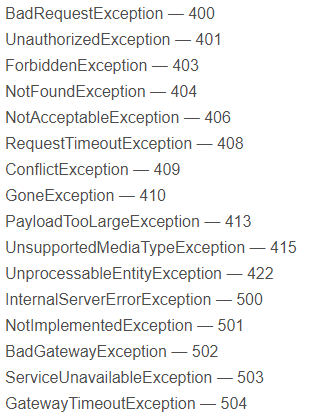

# nest.js

## 安装nestjs cli

`npm i -g @nestjs/cli` nestjs 的脚手架能更简单的创建项目

## 创建nestjs项目

```
> nest new
? What name would you like to use for the new project?(nest-app) my-project(这是新项目的名称，可以随便取名)
... // 创建一系列文件
? Which package manager would you □□ to use? (Use arrow keys) // 选择包管理器
> npm
  yarn
  pnpm
√ Installation in progress... // 创建项目完成
```

## 运行

`npm run start:dev`：运行项目并开启监视模式（--watch），在 `package.json` 文件中可以查看完整命令

## 文件

- `app.controller.ts`：带有单个路由的基本控制器
- `app.controller.spec.ts`：针对控制器的单元测试
- `app.module.ts`：应用程序的根模块（root module）
- `main.ts`：应用程序的入口文件，它使用核心函数`nestFactory`来创建 Nest 应用程序的实例

> `main.ts`文件中包含了一个异步函数，此函数将**引导(bootstrap)**应用程序的启动流程。
>
> ```typescript
> /* main.ts */
> 
> import { NestFactory } from '@nestjs/core'
> import { AppModule } from './app.module'
> 
> async function bootstrap() {
>   	const app = NestFactory.create(AppModule)
>   	await app.listen(3000)
> }
> bootstrap()
> ```
>
> 要创建一个 Nest 应用程序的实例，我们使用了`NestFactory`核心类。`NestFactory`暴露了一些静态方法用于创建应用程序的实例。其中，`create()`方法返回一个应用程序的对象，该对象实现了`INestApplication`接口。
>
> 在上面`main.ts`示例中，仅启动了 HTTP 侦听器，该侦听器使应用程序可以侦听入栈的 HTTP 请求。

## 平台

目前支持两个 HTTP 平台：[express](https://expressjs.com/) 和 [fastify](https://www.fastify.io/)。

无论使用哪个平台，都会将平台的 application 接口暴露出来。它们分别是`NestExpressApplication`和`NestFastifyApplicetion`。

当将类型信息传递给`NestFactory.create()`方法时，`app`对象将具有该特定平台的专用方法。但是要注意，**除非确实需要访问底层平台的 API，否则无需指定平台类型。**

```typescript
const app = await NestFactory.create<NestExpressApplication>(AppModule)
```

## 控制器：Controller

控制层负责处理传入的 HTTP 请求，在 nest 中，控制器是要给带有`@Controller()`装饰器的类。

`controller`：控制器，用来提供 api 接口，负责处理**路由、中转、验证等一些简洁的业务** 

[完整文档链接](https://docs.nestjs.cn/8/controllers) 

### 创建控制器

完整写法：`nest generate controller`

```
nest generate controller
? What name would you like to use for the controller? myController (这是controller的名称，可以随便填写)

// 简写
nest g co
```

### 构建路径

- 这里构建一个名为`/users`的路径

```typescript
import { Controller, Get, Post, Delete, HttpStatus, Params, Body } from '@nestjs/common'

@Controller('users') // 这里声明这个控制器下所有的接口都归属于 /users 这个路径
export class UserController {
  // 创建一个 get 请求，这个请求的路径为 /users
  @Get()
  getAllUsers() {
    return {}
  }
  
  // 创建一个带参数的 get 请求，这个请求的路径为 /users/:id
  @Get(':id')
  getUserById(@Params() params) {
    // 使用 @Params() 装饰器可以获取到传入的所有参数
    return params.id
  }
  
  // 创建一个 post 请求，这个请求的路径为 /users/add
  @Post('add')
  addUser(@Body() body) {
    // 使用 @Body() 装饰器可以获取到 post 请求传入的 body 中的值
    return body
  }
  
  // 创建一个 delete 请求，这个请求的路径为 /users/del/:id
  @Delete('del/:id')
  removeUserById(@Params('id') id: string) {
    // 在 @Params() 装饰器中传入参数即可指定读取传入进来的 params 参数
    return id
  }
}
```

### 路由

在上面的代码中，我们使用 `@Controller()` 装饰器定义了一个基本的控制器。可选路由路径前缀为 `users` 。在 `@Controller()` 装饰器中使用路径前缀可以对一组相关的路由进行分组，并最大程度的减少重复代码。

### Request

处理程序有时需要访问客户端的**请求**细节。要获取请求对象，则可以在处理函数中使用 `@Req()` 装饰器，如：

```typescript
import { Controller, Get, Req } from '@nestjs/common'
import { Request } from 'express' // Nest 默认的底层平台是 express，也可以使用其他

@Controller('users')
export class UsersController {
  @Get()
  findAll(@Req() request: Request): string {
    return '这里可以通过 request 访问请求对象来获取请求细节'
  }
}
```

这里列举部分 Nest 提供的获取特定对象的装饰器：

| 装饰器                  | 对象               |
| ----------------------- | ------------------ |
| @Request()，@Req()      | req                |
| @response()，@Res()     | res                |
| @Next()                 | next               |
| @Session()              | req.session        |
| @Param(key?: string)    | req.params[key?]   |
| @Body(key?: string)     | req.body[key?]     |
| @Query(key?: string)    | req.query[key?]    |
| @Headers(name?: string) | req.headers[name?] |
| @Ip()                   | req.ip             |
| @HostParam()            | req.hosts          |

###  路由通配符

路由也支持模式匹配，如 `*` 被用作通配符，将匹配任何字符组合，如：`ab*cd` 会匹配 `abcd | ab_cd | abecd| ...` 。

字符 `? | + | * | ()` 是它们的正则表达式对应项的子集。连字符（`-`）和点（`.`）按字符串路径逐字解析。

### 状态码

可以在处理函数外通过添加 `@HttpCode()` 装饰器来更改默认相应的状态码。

```typescript
@Get()
@HttpCode(204)
getAll() {
  return '这个请求响应的状态码为204'
}
```

### Headers

要指定自定义响应头，可以使用 `@Header()` 装饰器或类库特有的响应对象(`req.header()`)。

```typescript
@Post()
@Header('Cache-Control', 'none')
create() {
  return '这个请求的头为 Cache-Control'
}
```

> ##### 注
>
> `Header` 需要从 `@nestjs/common` 包导入

### 重定向

要将响应重定向到特定的 `URL` ，可以使用 `@Redirect()` 装饰器或特定于库的响应对象(`res.redirect()`)。

`@Redirect()` 有两个可选参数：`url` 和 `statusCode` ，statusCode 默认为 302。

```typescript
@Get()
@Redirect('https://nestjs.com', 301)
```

如果想要动态的决定重定向，则需要通过从路由处理方法返回一个对下格式的对象：

```typescript
{
  "url": string,
  "statusCode": number
}
```

返回的值将覆盖传递给 `@Redirect()` 装饰器的所有参数。

```typescript
@Get()
@Redirect('https://doce.nestjs.com', 302)
getDocs(@Query('version') version) {
  if (version && version == '5') {
    return { url: 'https://doce.nestjs.com/v5/' }
  }
}
```

###  子域路由

子域路由与路由前缀一样，只不过是通过子域名而非路径前缀对分组路由进行约束，主要用来判断这个控制器在被访问时，限制具体的域名来访问。

`@Controller()` 装饰器接受一个 `host` 选项，以要求传入请求的 `HTTP` 主机匹配某个特定值。该 `host` 选项可以使用参数标识来捕获主机名中该位置的动态值，即捕获一个二级域名，可以使用 `@HostParam()` 装饰器访问以这种方式声明的主机参数，来获取这个二级域名：

```typescript
@Controller({ host: ':account.example.com' })
export calss AccountCountroller {
  @Get()
  getInfo(@HostParam('account') account: string) {
    return account
  }
}
```

> ##### 注
>
> 由于**Fastify**缺乏对嵌套路由器的支持，因此当使用子域路由时，应该改用**express**适配器。

### 异步性

Nest 将自行解析每个异步函数返回的 Promise。

```typescript
@Get()
async findAll(): Promise<any[]> {
  return []
}
```

此外，通过返回 RxJS [observable流]() ，Nest 将自动订阅下面的源并获取最后发出的值（在流完成后）。

```typescript
@Get()
findAll(): Observable<any[]> {
  return of([])
}
```

[简单实现一个 observable](https://zhuanlan.zhihu.com/p/110007033) 

[在TypeScript中使用Observables来转换数据](https://juejin.cn/post/7067851052841697310) 

## 提供者：Providers

Providers 是 `Nest` 的一个基本概念。许多基本的 `Nest` 类可能被视为 provider - `service | repository | factory | helper 等等`。 他们都可以通过 `constructor` **注入**依赖关系。 这意味着对象可以彼此创建各种关系，并且“连接”对象实例的功能在很大程度上可以委托给 `Nest`运行时系统。 

Provider 只是一个用 `@Injectable()` 装饰器注释的类。

[完整文档链接](https://docs.nestjs.cn/8/providers) 

## 服务：Service

`service`：是一系列服务、repo、工厂方法、helper 的总称，主要负责处理具体的业务，如**数据库的增删改查、事务、并发等逻辑代码**。其由 `controller` 使用，因此将其定义为一个 `provider` 是一个很好的选择。因此，使用 `@Injectable()` 来装饰这个类。

### 创建 service

```
nest generate service
? What name would you like to use for the service? myService (这是service的名称，可以随便填写)

// 简写
nest g s
```

### 构建一个 service

```typescript
import { Injectable } from '@nestjs/common';
import { Cat } from './interfaces/cat.interface';

@Injectable()
export class CatsService {
  private readonly cats: Cat[] = [];
  
  create(cat: Cat) {
    this.cats.push(cat);
  }
  
  findAll(): Cat[] {
    return this.cats;
  }
}
```

`interfaces/cat.interface`：

```typescript
export interface Cat {
  name: string;
  age: number;
  breed: string;
}
```

###  使用 service

```typescript
import { Controller, Get, Post, Body } from '@nestjs/common'
import { CreateCatDto } from './dto/create-cat.dto'
import { CatsService } from './cats.service'
import { Cat } from './interfaces/cat.interface'

@Controller('cats')
export class CatsController {
  constructor(private catsService: CatsService) {}
  
  @Post()
  async create(@Body() createCatDto: CreateCatDto) {
    this.catsService.create(createCatDto)
  }
  
  @Get()
  async findAll(): Promise<Cat[]> {
    return this.catsService.findAll()
  }
}
```

`/dto/create-cat.dto`：DTO(数据传输对象)，**是一种设计模式之间传输数据的软件应用系统。数据传输目标往往是数据访问对象从数据库中检索数据。数据传输对象与数据交互对象或数据访问对象之间的差异是一个以不具有任何行为除了存储和检索的数据（访问和存取器）。** 在 Nest中使用 DTO 一般是为了防止非法字段的提交和 IDE 自动提示。

```typescript
// 这里定义了一个 DTO 的结构
export class CreateCatDto {
  readonly name: string;
  readonly age: number;
  readonly breed: string;
}
```

### 依赖注入

在上面的例子中，将 `catsService` 通过创建并返回一个实例来解析 `CatsService` 。解析此依赖关系并将其传递给控制器的构造函数（或分配给指定的属性）：

`constructor(private readonly catsService: CatsService) {}` 

## 模块：Module

模块是具有 `@Module()` 装饰器的类。`@Module()` 装饰器提供了元数据，Nest 用它来组织应用程序结构。

[完整文档链接](https://docs.nestjs.cn/8/modules) 

### 创建模块 module

```
nest generate module myModule(这是模块名)

// 简写
nest g mo myModule
```

每个模块包含四个部分：`controllers, exports, imports, providers` 

| 属性        | 描述                                                       |
| ----------- | ---------------------------------------------------------- |
| providers   | 由 Nest 注入器实例化的提供者，并且可以至少在整个模块中共享 |
| controllers | 必须创建的一组控制器                                       |
| imports     | 导入其他被 exports 暴露处理的模块                          |
| exports     | 表示本模块会被暴露出去并可以被其他模块 imports 导入使用    |

> ##### 注：
>
> 要放在同一个文件夹下的 controller 、service 、module 在创建的时候名字要相同，如要放在 /users 这个文件夹下，如：
>
> ```
> nest g co users // 创建 controller
> nest g s users // 创建 service
> nest g mo users // 创建 module
> ```

当我们为每个模块创建了其 module 文件后，即可在 `app.module.ts`文件中导入，并将其放在`imports`数组中，这样就可以去掉`controllers`和`providers`中导入的这个模块的 controller 和 service，方便管理文件。如：

```typescript
/* app.mudole.ts */

import { Module } from '@nestjs/common';
import { AppController } from './app.controller';
import { AppService } from './app.service';
import { UsersModule } from './users/users.module';

@Module({
  imports: [UsersModule],
  controllers: [AppController],
  providers: [AppService],
})
export class AppModule {}
```

- module：负责将 controller 和 service 连接起来，类似于`namespace`的概念

### 功能模块

在上面的例子中，`CatsController` 和 `CatsService` 属于同一个应用程序域下，因此，应该将他们移动到一个功能模块下，即：

```typescript
/* cats.module.ts */
import { Module } from '@nestjs/common';
import { CatsController } from './cats.controller';
import { CatsService } from './cats.service';

@Module({
  controllers: [CatsController],
  providers: [CatsService],
})
export class CatsModule {}
```

在创建了 cats 的模块后，应将这个模块导入根模块：

```typescript
import { Module } from '@nestjs/common';
import { CatsModule } from './cats/cats.module';

@Module({
  imports: [CatsModule],
})
export class ApplicationModule {}
```

### 依赖注入

可以将 `service` 注入到模块（类）中：

```typescript
export class CatsModule {
  constructor(private readonly catsService: CatsService) {}
}
```

### 动态模块

 详情见完整文档

## 中间件：middleware

中间件是在路由处理程序之前调用的函数，中间件函数可以访问请求和响应对象，以及应用程序请求相应周期中的 `next()` 函数。

Nest 的中间件实际上等价于 express 的中间件。

[完整文档链接](https://docs.nestjs.cn/8/middlewares) 

### 定义中间件

Nest 中间件可以在函数中或在具有 `@Injectable()` 装饰器的类中实现自定义，被装饰的对象应该实现 `NestMiddleware` 接口。

```typescript
/* logger.middleware.ts */

import { Injectable, NestMiddleware } from '@nestjs/common';
import { Request, Response, NextFunction } from 'express';

@Injectable()
export class LoggerMiddleware implements NestMiddleware {
  use(req: Request, res: Response, next: NextFunction) {
    console.log('这是一个中间件')
    next()
  }
}
```

### 应用中间件

中间件不能在 `@Module()` 装饰器中列出。我们必须使用模块类的 `configure()` 方法来设置中间件。包含中间件的模块必须实现 `NestModule` 接口。下面的例子将 LoggerMiddleware 设置在 ApplicationModule 层上。

```typescript
/* app.module.ts */

import { Module, NestModule, MiddlewareConsumer, RequestMethod } from '@nestjs/common';
import { LoggerMiddleware } from './common/middleware/logger.middleware';
import { CatsModule } from './cats/cats.module';

@Module({
  imports: [CatsModule],
})
export class AppModule implements NestModule {
  configure(consumer: MiddlewareConsumer) {
    consumer
      .apply(LoggerMiddleware)
      .forRoutes('cats');
    	/*
    		上面使用 forRoutes('cats') 将这个中间件方法限定在 cats 这个模块中使用，如果想进一步将其限制在某一类请求方法则可以这样写：
    		forRoutes({ path: 'cats', method: RequestMethod.GET })
    		这里将其限定在 GET 请求，上面导入了 RequestMethod，
    		这里的 path 路径也可以使用路由通配符，详情见完整文档
    	*/
  }
}
```

> 可以使用 `async/await`来实现 `configure()`方法的异步化(例如，可以在 `configure()`方法体中等待异步操作的完成)。

### 中间件消费者

`MiddlewareConsummer` 是一个帮助类，它提供了几种内置方法来管理中间件，这个方法可以链式调用。

`forRoutes()` 可接受一个or多个字符串、对象、一个or多个控制器。

```typescript
/* app.module.ts */

import { Module, NestModule, MiddlewareConsumer } from '@nestjs/common';
import { LoggerMiddleware } from './common/middleware/logger.middleware';
import { CatsModule } from './cats/cats.module';
import { CatsController } from './cats/cats.controller.ts';

@Module({
  imports: [CatsModele],
})
export class AppModule implements NestModule {
  configure(consumer: MiddlewareConsumer) {
    consumer.apply(LoggerMiddleware).forRoutes(CatsController)
    // apply() 方法可以使用单个中间件，也可以使用多个参数来指定多个中间件
  }
}
```

如果想排除某些路由使用中间件，则可以使用 `exclude()` 方法。这个方法可以采用一个or多个字符串、一个**RouteInfo**对象来标识要排除的路由：

```typescript
consumer
	.apply(LoggerMiddleware)
	.exclude(
  	{ path: 'cats', method: RequestMethod.GET },
  	{ path: 'cats', method: RequestMethod.Post },
  	'cats/(.*)', // 该 exclude() 方法使用 path-to-regexp 包支持通配符参数。
	)
	.forRoutes(CatsController)
```

### 函数式中间件

如果定义的中间件非常简单，没有任何依赖关系、成员、方法等，如上面的 LoggerMiddleware ，则可以将其定义为一个函数式中间件：

```typescript
/* logger.middleware.ts */

export function logger(req, res, next) {
  console.log('这是一个函数式中间件')
  next()
}
```

- 使用函数式中间件：

  ```typescript
  /* app.module.ts */
  
  consumer
  	.apply(logger)
  	.forRoutes(CatsController)
  ```

### 多个中间件

要绑定顺序执行多个中间件，可以在 `apply()` 方法内用 `,` 分隔这些中间件：

`consumer.apply(cors(), helmet(), logger).forRoutes(CatsController)` 

### 全局中间件

如果要将中间件绑定到每个路由上，如下：

```typescript
const app = await NestFactory.create(AppModule);
app.use(logger);
await app.listen(3000);
```

## 异常过滤器

内置的**异常层**负责处理整个应用程序中的所有抛出的异常。

过滤操作由内置的全局异常过滤器执行，该过滤器处理类型 `HttpException` (及其子类) 的异常。当某个异常无法被全局异常过滤器识别时，用户将收到以下响应：

```json
{
  "statusCode": 500,
  "message": "Internal server error"
}
```

[完整文档链接](https://docs.nestjs.cn/8/exceptionfilters) 

### 基础异常类

Nest 提供了一个内置的 `HttpException` 类，从 `@nestjs/common` 包中导入。

假设目前有一个异常：

```typescript
/* cats.controller.ts */

@Get()
async findAll() {
  throw new HttpException('Forbidden', HttpStatus.FORBIDDEN)
  // HttpStatus 是从 @nestjs/common 包中导入的辅助枚举器
 	/* 这里的返回结果为：
 		{
 			"statusCode": 403,
 			"message": "Forbidden"
 		}
 	*/
}
```

`HttpException` 构造函数有两个必要的参数来决定响应：

- response：定义 JSON 响应体，可以是 string 或者 object，当只传入一个 string 时，只覆盖 JSON 相应主体的 message
- status：状态码，可以自己定义，也可以使用 HttpStatus 类中属性

默认情况下，JSON 响应主体包含两个属性：

- statusCode：默认为 status 参数中提供的状态码
- message：错误的简短描述

### 自定义异常

自定义异常继承自 `HttpException` 类，这样 Nest 可以自动识别异常，并处理错误响应。

```typescript
/* forbidden.exception.ts */

export class ForbiddenException extends HttpException {
  constructor() {
    super('Forbidden', HttpStatus.FORBIDDEN)
  }
}
```

- 使用

  ```typescript
  /* cats.controller.ts */
  
  @Get()
  async findAll() {
    throw new ForbiddenException()
  }
  ```

### 内置HTTP异常

Nest 提供了一系列继承自核心异常 `HttpException` 的可用异常，使用时直接 `throw new XXX(描述, 状态)` ，它们都可以从 `@nestjs/common` 包中导入，每个异常抛出的状态码不同：



### 异常过滤器

异常过滤器可以更加精确的将响应的内容发回给客户端，或者做一些更加精细的工作，如添加日志记录或基于一些动态因素使用其他 JSON 模式。

```typescript
/* http-exception.filter.ts */

// 所有的异常过滤器都应该实现通用的 ExceptionFilter<T> 接口，需要使用
// catch(exception: T, host: ArgumentsHost) 方法，T 表示异常的类型
import { ExceptionFilter, Catch, ArgumentsHost, HttpException } from '@nestjs/common'
// 导入 Request 和 Response ，分别用来获取请求信息和控制响应
import { Request, Response } from 'express'

// @Catch() 装饰器绑定所需的元数据到异常过滤器上，它告知 Nest 这个特定的过滤器要
// 寻找哪一类异常。
// @Catch() 可以传递多个参数，通过逗号隔开，这样可以给多个类型的异常设置过滤器
@Catch(HttpException)
// 创建一个异常过滤器，负责捕获作为 HttpException 类实例的异常
export class HttpExceptionFilter implements ExceptionFilter {
  // exception：当前正在处理的异常对象
  // host：传递给原始处理程序的参数的一个包装（Response/Request）的引用
  catch(exception: HttpException, host: ArgumentsHost) {
    const ctx = host.switchToHttp()
    const response = ctx.getResponse<Response>()
    const request = ctx.getRequest<Request>()
    const status = exception.getStatus()
    const message = exception.message || 
          exception.message.message || 
          exception.message.error || 
          null
    
    // 使用 Response.json() 方法，使用 Response 对象直接控制发送的响应
    response
    	.status(status)
    	.json({
      	statusCode: status, // 系统错误状态
      	timestamp: new Data().toISOString(), // 错误日期
      	path: request.url, // 错误路由
      	message: '', // 错误信息
      	data: message, // 错误消息的具体内容
    	})
  }
}
```

- 使用

  1. 全局使用：在 `main.ts` 中导入需要的模块，但后使用 `app.useGlobalFilters(new HttpExceptionFilter())` 即可

     ```typescript
     /* main.ts */
     
     async function bootstrap() {
       const app = await NestFactory.create(AppModule)
       app.useGlobalFilters(new HttpExceptionFilter())
       wait app.listen(3000)
     }
     bootstrap()
     ```

  2. 模块使用：在需要使用的 controller 中导入模块，然后从 `@nestjs/common` 中导入 `UseFilters` 装饰器，最后将其放在对应的 `@Controller()` 或者 `@Get() | @Post() | ...` 之下即可

     ```typescript
     /* cats.controller.ts */
     
     @Post()
     // UseFilters 可以使用单个过滤器，也可以用逗号分隔多个过滤器
     @UseFilters(HttpExceptionFilter)
     // @UseFilters(new HttpExceptionFilter()) 两种写法都可以
     async create(@Body() createCatDto: CreateCatDto) {
       throw new ForbiddenException()
     }
     ```

### 捕获所有异常

为了捕获每一个未处理的异常，不论类型，即可将 `@Catch()` 参数列表设为空

```typescript
import {
  ExceptionFilter,
  Catch,
  ArgumentsHost,
  HttpException,
  HttpStatus,
} from '@nestjs/common';

@Catch()
export class AllExceptionsFilter implements ExceptionFilter {
  catch(exception: unknown, host: ArgumentsHost) {
    const ctx = host.switchToHttp();
    const response = ctx.getResponse();
    const request = ctx.getRequest();
    const status =
      exception instanceof HttpException
        ? exception.getStatus()
        : HttpStatus.INTERNAL_SERVER_ERROR;
    
    response.status(status).json({
      statusCode: status,
      timestamp: new Date().toISOString(),
      path: request.url,
    });
  }
}
```

## 管道

Nest 使用 `@Injectable()` 装饰器装饰管道，管道应实现 `PipeTransform` 接口

管道有两个作用：

- 转换：管道将输入数据转换为所需的数据输出
- 验证：对输入的数据进行验证，如果验证成功则继续传递，失败则抛出异常

`执行顺序：客户端请求->中间件->路由守卫->管道->控制器方法` 

[完整文档链接](https://docs.nestjs.cn/8/pipes) 

### 内置管道

Nest 有六个内置的管道，它们都从 `@nestjs/common` 包中导入：

- `ValidationPipe`
- `ParseIntPipe`
- `ParseBoolPipe`
- `ParseArrayPipe`
- `ParseUUIDPipe`
- `DefaultValuePipe`

### 开发一个管道

要了解上面这几个内置管道如何工作，这里以 `ValidationPipe` 为例来构建：

```typescript
/* validate.pipe.ts */

import { PipeTransform, Injectable, ArgumentMetadata } from '@nestjs/common'

@Injectable()
export class ValidationPipe implements PipeTransform {
  transform(value: any, metadata: ArgumentMetadata) {
    return value
  }
}
```

> `PipeTransform<T, R>` 是一个通用接口，其中 T 表示 value 的类型，R 表示 transform() 方法的返回类型。
>
> 每个管道都必须提供 `transform(value, metadata)` 方法，这两个参数分别表示：
>
> - value：当前处理的参数
> - metadata：元数据
>
> `value(即ArgumentMetadata)` 定义如下：
>
> ```typescript
> export interface ArgumentMetadata {
>   readonly type: 'body' | 'query' | 'param' | 'custom'; // 输入数据的来源
>   readonly metatype?: Type<any>; // 注入数据的类型
>   readonly data?: string; // 传递给装饰器的数据类型
> }
> ```
>
> 如下面这个控制器方法：
>
> ```typescript
> @Post()
> login(@Query('num') num: number) {
>  ...
> }
> // 这个方法的元数据如下：
> // type：query
> // metatype：Number
> // data：num
> ```

### 对象结构验证

一种常见的验证方式是使用基于结构的验证，[Joi](https://github.com/hapijs/joi) 库允许使用一个可读的 API 的方式创建 schema。

1. 安装依赖

   ```
   $ npm install --save @hapi/joi
   $ npm install --save-dev @types/hapi__joi
   ```

2. 使用Joi构建管道

   ```typescript
   import { PipeTransform, Injectable, ArgumentMetadata, BadRequestException } from '@nestjs/common'
   import { ObjectSchema } from '@hapi/joi'
   
   @Injectable()
   export class JoiValidationPipe implements PipeTransform {
     constructor(private schema: ObjectSchema) {}
     
     trnasform(value: any, metadata: ArgumentMetadata) {
       // 使用 joi 提供的 validate() 方法验证
       const { error } = this.schema.validate(value)
       
       if (error) {
         throw new BadRequestException('Validation failed')
       }
       return value
     }
   }
   ```

3. 使用这个管道

   可以在 controller 或者它的方法上使用，使用 `@UsePipes()` 装饰器并创建一个管道实例，将其传递给 Joi 验证。

   ```typescript
   @Post()
   @UsePipes(new JoiValidationPipe(createCatSchema))
   async create(@Body() createCatDto: CreateCatDto) {
     this.catsService.create(createCatDto)
   }
   ```

### class-validator

如果使用原始的 JavaScript 开发应用，则这个功能无法使用，需要使用 TypeScript 。

Nest 可以与 [class-validator](https://github.com/typestack/class-validator) 搭配使用，这个库允许我们使用基于装饰器的验证。

1. 安装：

   ```
   $ npm i --save class-validator class-transformer
   ```

2. 向 CreateCatDto 类中添加装饰器：[更多装饰器信息](https://github.com/typestack/class-validator#validation-decorators) 

   ```typescript
   /* create-cat.dto.ts */
   
   import { IsString, IsInt } from 'class-validator'
   
   export class CreateCatDto {
     @IsString()
     name: string;
     
     @IsInt()
     age: number;
     
     @IsString()
     breed: string;
   }
   ```

3. 创建一个管道：ValidationPipe 类

   ```typescript
   /* validate.pipe.ts */
   
   import { PipeTransform, Injectable, ArgumentMetadata, BadRequestException } from '@nestjs/common'
   import { validate } from 'class-validator'
   import { plainToClass } from 'class-transformer'
   
   @Injectable()
   export class ValidationPipe implements PipeTransform<any> {
     // 这里的 transform() 是异步的，因为 class-validator 可以验证 promise
     async transform(value: any, { metatype }: ArgumentMetadata) {
       // 使用 toValidate() 方法验证类型是不是 JavaScript 的数据类型
       if (!metatype || !this.toValidate(metatype)) {
         return value
       }
       
       // 使用 class-transformer 的 plainToClass() 方法来转换参数为可验证的类型对象
       // class-validator 需要使用前面定义的 DTO ，就需要做一个类型转换。
       const object = plainToClass(metatype, value)
       const errors = await validate(object)
       if (errors.length > 0) {
         throw new BadRequestExceotion('validation failed')
       }
       return value
     }
     
     private toValidate(metatype: Function): boolean {
       const types: Function[] = [String, Boolean, Number, Array, Object]
       return !type.includes(metatype)
     }
   }
   ```

4. 使用管道

   - 参数范围使用

     ```typescript
     /* cats.controller.ts */
     
     @Post()
     async create(@Body(new ValidationPipe()) createCatDto: CreateCatDto) {
       this.catsService.create(createCatDto)
     }
     ```

   - 方法范围使用

     ```typescript
     /* cats.controller.ts */
     
     @Post()
     @UsePipes(ValidationPipe)
     // @UsePipes(new ValidationPipe())
     async create(@Body() createCatDto: CreateCatDto) {
       this.catsService.create(createCatDto)
     }
     ```

   - 全局范围使用

     ```typescript
     /* main.ts */
     
     async function bootstrap() {
       const app = await NestFactory.create(AppModule)
       app.useGlobalPipes(new ValidationPipe())
       await app.listen(3000)
     }
     bootstrap()
     ```

   ### 转换通道

   有时从客户端传过来的数据需要经过一些修改(例如字符串转化为整数)，然后处理函数才能正确的处理。或者某些数据具有默认值，当用户没有传递这些数据时，就使用默认值。

   ```typescript
   /* parse-int.pipe.ts */
   
   import { PipeTransform, Injectable, ArgumentMetadata, BadRequestException } from '@nestjs/common'
   
   @Injectable()
   export class ParseIntPipe implements PipeTransform<string, number> {
     transform(value: string, metadata: ArgumentMetadata): number {
       const val = parseInt(value, 10)
       if (isNaN(val)) {
         throw new BadRequestException('Validation failed')
       }
       return val
     }
   }
   ```

   使用上面这个管道来处理参数：

   ```typescript
   @Get(':id')
   async findOne(@Param('id', newew ParseIntPipe()) id) {
     return await this.catsService.findOne(id)
   }
   ```

## 路由守卫

与 Vue 的路由守卫类似，就是在访问指定路由前调用一个处理函数，如果返回 true 则使用 next() ，否则阻拦这个访问。

Nest 的路由守卫使用 `@Injectable()` 装饰，通过继承 `CanActive` 接口即可定义。

[完整文档链接](https://docs.nestjs.cn/8/guards) 

```typescript
import { CanActivate, ExecutionContext, Injectable } from '@nestjs/common';
import { Observable } from 'rxjs';

@Injectable()
class AppGuard implements CanActivate {
  canActivate(context: ExecutionContext): boolean | Promise<boolean> | Observable<boolean> {
    return true;
  }
}
```

 [其他参考](https://juejin.cn/post/6844903925435498504) 

### 执行上下文

CanActive 接口的方法中有一个 ExecutionContext 对象，该对象为请求上下文对象，定于如下：

```typescript
export interface ExecutionContext extends ArgumentsHost {
  // 获取当前访问的 Controller 对象（不是实例），T 为调用时传入的具体控制器对象泛型参数
  getClass<T = any>(): Type<T>;
  // 获取当前访问路由的方法
  getHandler(): Function;
}
```

ExecutionContext 继承自 ArgumentsHost，对于 ArgumentsHost 的详细信息可以在**异常过滤器**章节查看。

### 路由守卫级别

同样的，路由守卫也分为三种：全局、控制器、方法

- 全局级别：与全局异常过滤器类似，对所有控制器的所有路由方法生效，不会对 WebSocket 和 GRPC 生效。

  ```typescript
  async function bootstrap() {
    const app = await NestFactory.create(AppModule)
    // 由于 main.ts 启动时并未初始化依赖注入容器，所以依赖必须手动传入，一般情况下不建议使用全局守卫，因为依赖注入得自己解决。
    app.useGlobalGuards(new UserGuard(new UserService()))
    await app.listen(3000)
  }
  bootstrap()
  ```

- 控制器级别：该级别对这个控制器的所有路由方法生效

  ```typescript
  @Controller('user')
  @UseGuards(UserGuard)
  export class UserController {
    @Get('info')
    info() {
      return { ... }
    }
  }
  ```

- 方法级别：这个级别只对这个方法生效

  ```typescript
  @Get('info')
  @UseGuard(UserGuard)
  info() {
    return { ... }
  }
  ```

### 反射器

Nest 提供了一个 `@SetMetadata()` 装饰器，我们可以通过这个装饰器将定制元数据附加到路由处理程序。这些元数据提供了我们缺少的数据，而守卫需要通过这些数据来做出判断。

```typescript
/* cats.controller.ts */

@Post()
// roles 是一个键，['admin'] 是一个特定的值，这两个组成了 roles 的元数据，这里将这个元数据附加到 create() 方法
@SetMetadata('roles', ['admin'])
async create(@Body() createCatDto: CreateCatDto) {
  this.catsService.create(createCatDto)
}
```

当然，Nest 并不推荐直接使用  `@SetMetadata()` 装饰器，而更推荐我们创建自己的装饰器来使用：

```typescript
/* roles.decorator.ts */

import { SetMetadata } from '@nestjs/common'

export const Roles = (...roles: string[]) => SetMetadata('roles', roles) 
```

- 使用自定义的装饰器

  ```typescript
  /* cats.controller.ts */
  
  @Post()
  @Roles('admin')
  async create(@Body() createCatDto: CreateCatDto) {
    this.catsService.create(createCatDto)
  }
  ```

  

### 示例：基于角色的权限验证

- 定义角色装饰器：被角色装饰器装饰的控制器或者方法在访问时，路由守卫会读取当前用户的角色，与装饰器传入的角色进行匹配，若失败则阻断请求，否则放行。

  ```typescript
  /* roles.decorator.ts */
  
  import { SetMetadata } from '@nestjs/common'
  
  export class Roles = (...roles: string[]) => SetMetadata('roles', roles)
  ```

- 定义控制器：假设有一个只允许管理员访问的创建用户的接口

  ```typescript
  @Post('create')
  @Roles('admin')
  async create(@Body() createUserDto: CreateUserDto) {
    this.userService.create(createUserDto)
  }
  ```

- 定义路由守卫

  ```typescript
  /* role.guard.ts */
  
  import { Injectable, CanActivate, ExecutionContext } from '@nestjs/common';
  import { Observable } from 'rxjs';
  import { Reflector } from '@nestjs/core';
  
  @Injectable()
  export class RolesGuard implements CanActivate {
    constructor(private readonly reflector: Reflector) {}
    
    canActivate(context: ExecutinContext): boolean {
      // 获取 roles 元数据，roles 与 roles.decorator.ts 中 SetMetadata() 第一个参数(键)一致
      const roles = this.reflector.get<string[]>('roles', context.getHandler())
      if (!roles) {
        // 未被装饰器装饰，直接放行
        return true
      }
      const request = context.switchToHttp().getRequest()
      const user = request.user
      // 读取请求对象的 user，该user对象可以通过中间件来设置
      const hasRole = () => user.roles.some((role) => roles.includes(role))
      return user && user.roles && hasRole()
    }
  }
  ```

  > 使用 `Reflector` 类来访问路由的自定义元数据

## 拦截器

拦截器是基于AOP(面向切面编程)编程思想的一种应用，常用功能有：

- 在方法执行之前或之后执行**额外逻辑**，这些逻辑一般不属于业务的一部分
- **转换**函数返回的结果
- **转换**函数抛出的异常
- 拓展函数的基本行为
- 根据场景完全重写函数

[完整文档链接](https://docs.nestjs.cn/8/interceptors) 

[其他参考文档](https://juejin.cn/post/6844903939196846087) 

### 基础

每个拦截器都含有 `intercept()` 方法，他接收两个参数：

1. `ExecutionContext` 实例：与守卫完全相同的对象，继承自 `ArgumentsHost` 。

2. `CallHandler` ：路由处理函数。

    接口定义如下：

   ```typescript
   export interface CallHandler<T = any> {
       handle(): Observable<T>; // 这是一个 RxJs 包装对象
   }
   ```

   `handle()` 函数的返回值也就是对应路由函数的返回值。如下，当访问 `/user/list` 时，路由处理函数返回 `[]` ，在应用拦截器的情况下，调用了 `handle()` 方法后得到的也是 `Obervable<[]>` 。

   ```typescript
   /* user.controller.ts */
   
   @Controller('user')
   export class UserController {
     @Get('list')
     list() {
       return [];
     }
   }
   ```

   > ##### 注
   >
   > 如果在拦截器中调用了 next.handle() 方法，就会执行对应的路由处理函数，如果不调用的话就不会执行。

### 定义一个拦截器

这个示例是：在方法执行之前或之后执行**额外逻辑**。

```typescript
/* logging.interceptor.ts */

import { Injectable, NestInterceptor, ExecutionContext, CallHandler } from '@nestjs/common';
import { Observable } from 'rxjs';
import { tap } from 'rxjs/operators';

@Injectable()
export class LoggingInterceptor implements NestInterceptor {
  intercept(context: ExecutionContext, next: CallHandler): Observable<any> {
    console.log('Before...');
    const now = Date.now();
    return next
      .handle()
      .pipe(
        tap(() => console.log(`After... ${Date.now() - now}ms`)),
      );
    // 由于 handle() 返回一个 RxJS Observable，我们有很多种操作符可以用来操作流。在这里，我们使用了 tap() 运算符，该运算符在可观察序列的正常或异常终止时调用函数。
  }
}
```

### 拦截器作用域

同样的，拦截器作用域也有三种：全局、控制器、路由方法

- 全局拦截器：

  ```typescript
  /* main.ts */
  
  const app = await NestFactory.create(AppModule);
  app.useGlobalInterceptors(new AppInterceptor());
  ```

- 控制器拦截器：

  ```typescript
  @Controller('user')
  @UseInterceptors(AppInterceptor)
  export class UserController {
  }
  ```

- 路由方法拦截器：

  ```typescript
  @Controller('user')
  export class UserController {
    @UseInterceptors(AppInterceptor)
    @Get()
    list() {
      return [];
    }
  }
  ```

## 自定义装饰器

[完整文档链接](https://docs.nestjs.cn/8/customdecorators)  

### 装饰器

Nest 是基于装饰器这种语言特性而创建的。简单来说，`ES2016` 的装饰器是一个可以将目标对象、名称和属性描述符作为参数的返回函数的表达式。装饰器使用 `@` 前缀来使用。装饰器可以放置在想要装饰的对象的最顶端。装饰器可以被定义为一个类或是属性。

### 自定义

这里创建一个 `@User()` 装饰器并在所有控制器中重复利用：

```typescript
/* user.decorator.ts */

import { createParamDecorator, ExecutionContext } from '@nestjs/common'

// 这个装饰器的作用是将 user 这个属性附加到 request 对象上，方便在路由方法中访问
export const User = createParamDecorator(
  (data: unknown, ctx: ExecutionContext) => {
  	const request = ctx.switchToHttp().getRequest()
  	return request.user
	},
)
```

- 使用 `@User()` ：

  ```typescript
  @Get()
  async findOne(@User() user: UserEntity) {
    console.log(user)
  }
  ```

### 传递数据

当装饰器的行为取决于某些条件时，可以使用 `data` 参数将其传递给装饰器的工厂函数。

这里，假设我们的身份验证层验证请求并将用户实体附加到请求对象，经过身份验证的请求的用户实体可能类似于：

```json
{
  "id": 101,
  "firstName": "Alan",
  "lastName": "Turing",
  "email": "alan@email.com",
  "roles": ["admin"]
}
```

定义一个将属性名作为键的装饰器，如果存在则返回相关联的值，如果不存在或者还没有创建 user 对象，则返回 undefined。

```typescript
/* user.decorator.ts */

import { createParamDecorator, ExecutionContext } from '@nestjs/common'

export const User = createParamDecorator(
  (data: string, ctx: ExecutionContext) => {
  	const request = ctx.switchToHttp().getRequest()
  	const user = request.user
  	return data ? user && user[data] : user
	},
)
```

使用 `@User()` 装饰器访问特定属性

```typescript
@Get()
async findOne(@User('firstName') firstName: string) {
  console.log(`Hello ${firstName}`)
}
```


