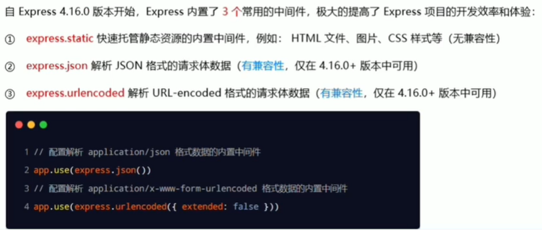
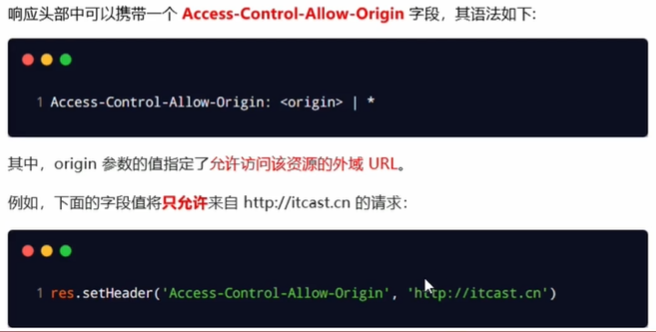
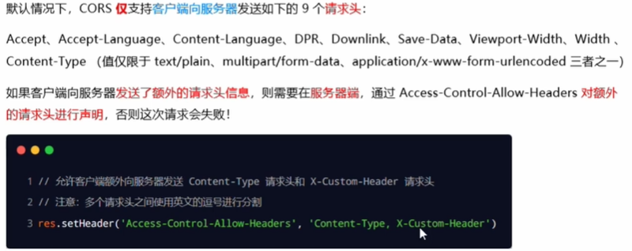
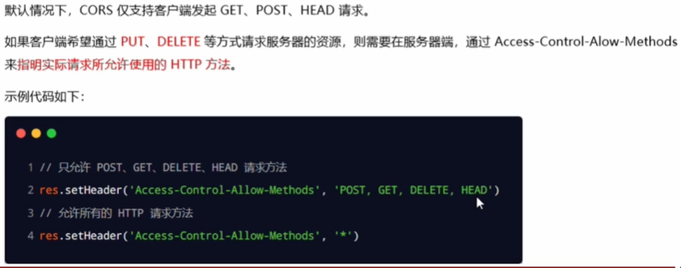
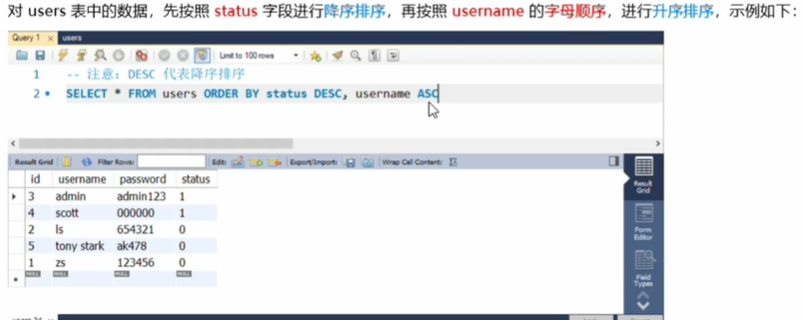
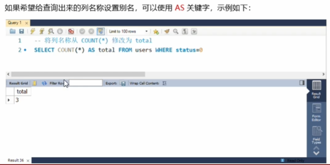
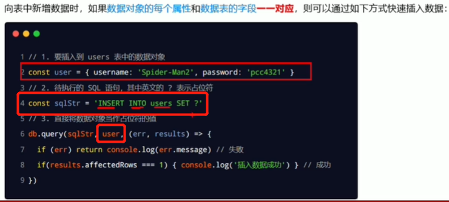
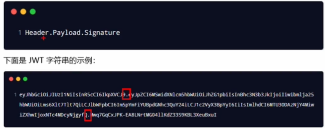
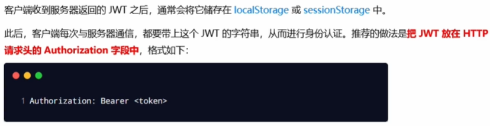
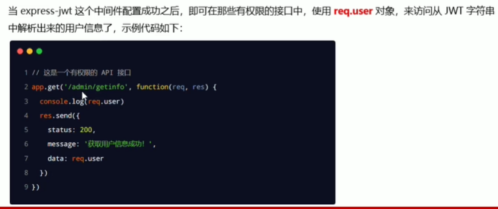

## fs 读取 / 写入文件

1. 导入 fs

   ```js
   const fs = require('fs')
   ```

2. 使用 `fs.readFile()` 读取文件内容，`fs.writeFile()` 向文件写入内容

   - `fs.readFile(path[, options], callback)`：

     1. path：必填参数，表示文件路径

     2. options：可选参数，表示以什么编码格式读取，一般指定 utf8

     3. callback：必填参数，回调函数，拿到读取结果

        回调函数有两个参数，参数1：失败的结果；参数2：成功的结果

     ```js
     const fs = require('fs')
     
     fs.readFile('./data.json', 'utf8', (err, dataStr) => {
     	console.log('error', err) // 读取成功输出 null，读取失败输出一个错误对象
     	console.log('dataStr', dataStr) // 读取成功输出数据，读取失败输出 undefined
     })
     ```

   - `fs.writeFile(path, data[, options], callback)`：

     1. path：必选参数，表示文件的存放路径，可以是已存在的文件（覆盖内容），也可以是不存在的文件（新建文件，不能新建文件夹）
     2. data：必选参数，表示要向文件写入的数据，非字符串格式报错
     3. options：可选参数，表示以什么格式写入文件，默认 utf8
     4. callback：必选参数，回调函数，只有一个参数，失败后的返回结果

     ```js
     fs.writeFile('./data.json', 'data', err => {
     	console.log('error', err) // 写入成功返回 null，写入失败返回一个错误对象
     })
     ```

### fs 模块，路径动态拼接的问题

在使用 fs 模块操作文件时，如果提供的操作路径是以 ./ 或 ../ 开头的相对路径时，很容易出现路径动态拼接错误的问题。

原因：代码在运行的时候，会以执行 node 命令时所处的目录，动态拼接出被操作文件的完整路径。

解决办法：

1. 提供绝对路径。但是这种方法移植性差，不利于维护。

2. `__dirname`：表示当前文件所处的目录

   ```js
   fs.readFile(__dirname + '/data.json', 'utf8', (err, dataStr) => {
   	console.log('error', err) // 读取成功输出 null，读取失败输出一个错误对象
   	console.log('dataStr', dataStr) // 读取成功输出数据，读取失败输出 undefined
   })
   ```

## path 路劲模块

1. 引入 path 模块：

   ```js
   const path = require('path')
   ```

2. 使用 `path.join()` 将多个路径片段拼接成一个完整的路径字符串，使用 `path.basename()` 方法用来从路径字符串中，将文件名解析出来，使用 `path.extname()` 获取文件拓展名

   - `path.join([...path])`：

     参数没有个数限制，返回值为拼接好的路径字符串

     ```js
     const pathStr = path.join('/a', '/b', '/c')
     console.log(pathStr) // \a\b\c
     
     const pathStr2 = path.join('/a', '/b/c', '../', '/d')
     console.log(pathStr2) // \a\b\d  '../'抵消了一层路径
     ```

   - `path.basename(path[, ext])`：

     有两个参数，参数1是文件路径，参数2是要去掉的文件名后的拓展名

     ```js
     const path = '/a/b/index.html'
     const filename = path.basename(path)
     console.log(filename) // index.html
     const filename2 = path.basename(path, '.html')
     console.log(filename2) // index
     ```

   - `path.extname(path)`：

     参数 path 必选，为文件路径

     ```js
     const path = '/a/b/index.html'
     const extname = path.extname(path) 
     console.log(extname) // .html
     ```

## http 模块

1. 引入 http 模块

   ```js
   const http = require('http')
   ```

2. 使用 `http.createServer()` 能将一台普通的电脑变成一台 Web 服务器

   ```js
   const server = http.createServer()
   ```

3. 绑定 request 事件，监听客户端发送的网络请求

   ```js
   server.on('request', (req, res) => {
     // 参数一：请求类型
     // 参数二：请求成功的回调
     /* req 是请求对象，它包含了与客户端相关的数据合属性，如：
           1、req.url 是客户端请求的 url 地址，输出的是端口号后面的内容
           2、req.method 是客户端请求的类型，get 、post、delete等
          res 响应对象，可以使用 res.end(数据) 的形式给浏览器返回数据 */
     console.log('req.url', req.url)
   	console.log('req.method', req.method)
     // 这句话是为了解决 res.end() 方法发送中文时的乱码问题
     res.setHeader('Content-Type', 'text/html; charset=utf-8') 
     res.end(`请求地址和类型: ${req.url + req.method}`)
   	console.log('有人请求了服务器')
   })
   ```

4. 调用服务器实例的 `.listen(端口号, 回调函数)` 方法，即可启动当前的 web 服务器实例

   ```js
   server.listen(80, () => {
     console.log('服务器启动成功，地址为 http://127.0.0.1:80')
   }) 
   ```


## 模块化

### module.exports 

导出一个对象，向外界共享

### require

导入一个模块，实际是导入的那个模块中 module 对象中的 export 属性，即 module.exports 导出的对象

> require 模块时，得到的永远是 module.exports 指向的对象

## express

与 nodejs 中内置的 http 模块类似，都是专门用来创建 Web 服务器的。

### 用 express 搭建 Web 服务器

```js
// 引入 express
const express = require('express')

// 创建 Web 服务
const app = express()

// 启动 Web 服务
app.listen(80, () => {
	console.log('服务启动成功')
})
```

### 监听 get 请求

使用 `app.get()` 方法，可以监听客户端的 get 请求，如法如下：

```js
app.get('请求 url', (req, res) => {
  // 参数1：客户端请求的 url 地址
  // 参数2：请求对应的处理函数
  /* 
  		req：请求对象，包含与请求相关的属性与方法
  		res：响应对象，包含了与响应相关的属性与方法
  */
  ...
})
```

### 监听 post 请求

使用 `app.post()` 方法，可以监听客户端的 get 请求，如法如下：

```js
app.post('请求 url', (req, res) => {
  // 参数1：客户端请求的 url 地址
  // 参数2：请求对应的处理函数
  /* 
  		req：请求对象，包含与请求相关的属性与方法
  		res：响应对象，包含了与响应相关的属性与方法
  */
  ...
})
```

### 把内容返回给客户端

使用 `res.send()` 方法，将处理好的内容，发送给客户端：

```js
app.get('请求 url', (req, res) => {
  ...
  res.send(数据)
})

app.post('请求 url', (req, res) => {
  ...
  res.send('请求成功')
})
```

### 获取 url 中携带的查询参数

使用 `res.query` 对象，可以访问到客户端通过查询字符串的形式发送到服务器的参数

```js
app.get('/user', (req, res) => {
  ...
  console.log(res.query)
})
```

### 匹配动态参数

使用 `:参数名` 的形式获取动态参数

```js
app.get('/user/:id/:name', (req, res) => {
  ...
  console.log(req.params)
})
```

### 托管静态资源

使用 `express.static()` ，可以非常方便的创建一个静态资源服务器

```js
app.use(express.static('文件夹名')) // 指定的这个文件名不会出现在访问资源的 url 路径中
```

#### 挂载路径前缀

```js
app.use('/文件夹名', express.static('文件夹名'))
// 指定的这个文件名会出现在访问资源的 url 路径中
```

## express 中的路由

express 中的路由由三部分组成，分别是请求类型、请求的 url 地址、处理函数，如下：

```js
app.METHOD(PATH, HANDLER)
```

### 创建路由模块

在 router.js 文件中代码如下：

```js
const express = require('express')
const router = express.Router() // 创建路由对象

router.get('/user/list', (req, res) => { // 挂载获取用户列表的路由
  ...
})

router.post('/user/add', (req, res) => { // 挂载添加用户的路由
  ...
})

module.exports = router
```

在 index.js 文件中代码如下：

```js
const express = require('express')
const app = express()

const router = require('router') // 引入 router.js 文件中的路由模块
app.use(router) // 注册路由模块，访问路径为 http://127.0.0.1/路径

app.listen(80, () => {
  ...
})
```

### 挂载访问前缀

```js
app.use('/api', router) // 这样访问路径为 http://127.0.0.1/api/路径
```

## app.use() 的作用

用来注册全局中间件

## express 中间件

express 的中间件本质上就是一个 function 处理函数，格式如下：

```js
app.get('/', function(req, res, next) {
  next() // 中间件函数的形参列表中，必须包含 next 参数。而路由处理函数中只包含 req 和 res
})
```

### next 函数的作用

next 是实现多个中间件连续调用的关系，他表示把流转关系转交给下一个中间件或路由

### 全局生效的中间件

```js
const express = reqiure('express')
const app = express()

function mw(req, res, next) {
  console.log('这是一个简单的中间件')
  next()
}

app.use(mw) // 使用 app.use() 是注册了全局中间件，对所有的路由都生效

app.get('/', (req, res) => {
  console.log('中间件调用了这个路由')
})

app.listen(80, (req, res) => {
  ...
})
```

### 局部生效的中间件

```js
const express = reqiure('express')
const app = express()

function mw(req, res, next) {
  console.log('这是一个简单的中间件')
  next()
}

app.get('/', mw, (req, res) => {
  // 直接将中间件传给路由，是局部生效的中间件，只对这个路由生效，局部中间件可以写任意多个
  console.log('中间件调用了这个路由')
})

app.listen(80, (req, res) => {
  ...
})
```

> 中间件使用注意：
>
> 1. 一定要在路由前注册中间件（错误级别中间件除外）
> 2. 中间件可以连续调用多个
> 3. 不要忘记调用 next() 函数
> 4. 调用 next() 后不要写别的代码，防止逻辑混乱
> 5. 连续调用多个中间件之间 req 和 res 是共享的

### 错误级别中间件

用来捕获整个项目中发生的异常错误，从而防止项目异常崩溃的问题。格式：

```js
function mw(err, req, res, next) {
  /* 
  	含有四个形参，比普通中间件多个了 err 参数，获取错误信息
  */
}
```

> 这个中间件要注册在所有路由之后，因为其要获取全局的错误。

### express 内置的中间件



### 监听 req 的 data 事件

```js
req.on('data', (chunk) => {
  ...
})
```

### 监听 req 的 end 事件

```js
req.on('end', (chunk) => {
  ...
})
```

### 使用 querystring 模块解析请求体数据

这是 nodejs 内置的模块，专门用来处理查询字符串。通过这个模块提供的 `parse()` 函数，可以将查询字符串解析成对象的格式，代码如下：

```js
const qs = require('querystring')
const body = qs.parse(str)
```

### 解决跨域问题

- CORS（推荐，主流应用）

  cors 是 express 的一个第三方中间件。通过安装和配置 cors 中间件可以解决跨域问题。使用 npm 进行安装。

  1. 引入 cors

     ```js
     const cors = require('cors')
     ```

  2. 使用 cors

     ```js
     app.use(cors()) // 必须写在所有的路由之前
     ```

- JSONP（不推荐，只支持 GET）

### CORS 响应头

1. `Access-Control-Allow-Origin`：

   

2. `Access-Control-Allow-Headers`：

   

3. `Access-Control-Allow-Methods`：

   

## SQL 语句

### 查询

```sql
select 字段 from 表名
-- 多个字段名之间用 "," 逗号隔开
```

### 插入

```sql
insert into 表名(列1, 列2, ...) values(值1, 值2, ...)
```

### 更新

```sql
update 表名 set 列名=新值, 列名=新值 where 列名=某个值
```

### 删除

```sql
delete from 表名 where 列名=值
/* 
	使用 delete 语句会真正的将数据从表中删除，为了保险起见，可以给每个数据加上 status 字段，用于标记删除，这样数据还保留在表中，可通过 status 将其过滤掉。
	这样可以不使用 delete 语句，使用 update 语句更新 status 即可
*/
```

### where 子句


### and 和 or 运算符


### 排序


### 多重排序



### count 函数


### as 关键字



## mysql 模块

`npm i mysql` ：安装 mysql 模块

1. 导入 mysql 模块

   ```js
   const mysql = require('mysql')
   ```

2. 建立与 MySQL 数据库的连接

   ```js
   const db = mysql.createPool({
   	host: '127.0.0.1', // 数据库的 ip 地址
     user: 'root', // 登录数据库的用户名
     password: '123456', // 登录数据库的密码
     database: 'mycontrol' // 指定哪个数据库
   })
   ```

3. 使用 `db.query()` 函数，指定要执行的 sql 语句，通过回调函数拿到结果：

   ```js
   db.query('select * from trademark', (err, res) => {
     if (err) return console.log(err.message)
     console.log(res)
   })
   /* 
   	当执行 delete 语句后，结果也是一个对象，也会包含 affectedRows 属性，
   	当其为 1 时说明删除成功
   */
   ```

### ? 占位符

在 sql 语句中，可以使用 ? 占位符表示一个具体的值，后面再在 .query() 函数中填入具体值的内容

```js
const str = 'insert into 表名(username, password) values(?, ?)' // 使用 ? 占位符
const username = 'zhangsan'
const password = 1232123

db.query(str, [username, password], (err, res) => {
  if (err) return console.log(err.message)
  console.log(res)
})
```

### 插入数据的便捷方式



## 身份认证

- 服务器端渲染的开发模式建议使用 Session 认证机制
- 前后端分离的开发模式建议使用 JWT 认证机制

### session

#### 向 session 中存入数据

1.  `npm i express-session`：安装 express-session 中间件

2. 注册 session 中间件：

   ```js
   const session = require('express-session')
   
   app.use(session({
     secret: '', // 可以为任意字符串
     resave: false, // 固定写法
     saveUninitialized: true // 固定写法
   }))
   ```

3. 使用 `req.session` 来访问和使用 session 对象：

   ```js
   app.post('/api/login', (req, res) => {
     if (req.body.username !== 'admin' || req.body.password !== '123456') {
       return res.send({status: 1, msg: '登录失败，账号或密码错误'})
     }
     
     // 只有成功配置了 express-session 这个中间件后，才能使用 req.session 这个属性
     req.session.user = req.body
     req.session.islogin = true
     
     res.send({status: 0, msg: '登录成功'})
   })
   ```

#### 从 session 中取数据

直接从 req.session 中取出来使用即可

```js
app.get('/api/username', (req, res) => {
  // 判断用户是否登录
  if (!req.session.islogin) {
    return res.send({status: 1, msg: 'fail'})
  }
  res.send({status: 0, msg: 'success', username: req.session.user.username})
})
```

#### 清空 session

调用 `req.session.destory()` 方法清空 session

```js
app.post('/api/logout', (req, res) => {
  req.session.destory()
  res.send({status: 0, msg: '退出登录成功'})
})
```

### JWT

JWT 通常由三部分组成，分别是 Header（头部）、Payload（有效荷载）、Signature（签名）。三者之间使用英文逗号隔开 "," 。格式如下：



1. Header：安全性相关，保证 token 的安全性
2. Payload：用户信息部分，是用户信息经过加密之后生成的字符串
3. Signature：跟 Header 一样

#### 使用方式



1. 安装 JWT 相关的包

   ```
   npm i jsonwebtoken express-jwt
   ```

   - jsonwebtoken：用户生成 JWT 字符串
   - express-jwt：将 JWT 字符串解析还原成 json 对象

2. 使用：***加密***

   ```js
   const jwt = require('jsonwebtoken')
   // const expressJWT = require('express-jwt')
   
   const secretKey = 'hhhhhhh' // 填写任意字符串，这个密钥用于加密和解密
   
   app.post('/api/login', (req, res) => {
     // 登录失败Or成功相关代码省略 ...
     res.send({
       status: 200, 
       msg: '登录成功',
       token: jwt.sign(
         {username: userinfo.username}, // 用户信息
         secretKey, // 密钥
         {expriesIn: '30s'}) // 过期时间，这里设定为 30 秒
     })
   })
   ```

3. 使用：***解密***

   ```js
   const expressJWT = require('express-jwt')
   
   app.use(expressJWT({secret: secretKey}).unless({path: [/^\/api\//]}))
   // 这里的意思是使用 secretKey 密钥进行解密，且以 /api 开头的请求路径不需要权限
   // 只要配置了 express-jwt 这个中间件，就可以把解析出来的用户信息挂载到 req.user 属性上
   ```

   - 使用 `req.user` 访问从 JWT 字符串中解析出来的用户信息

     

4. 捕获解析失败的错误

   

