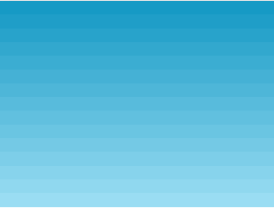
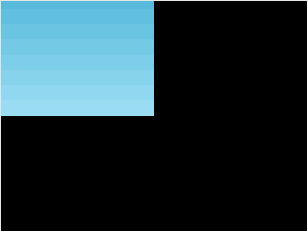
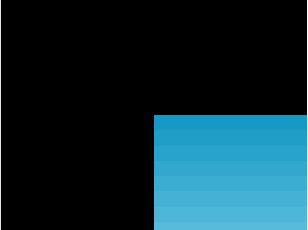
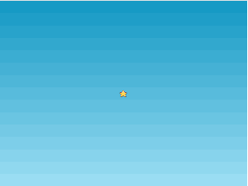
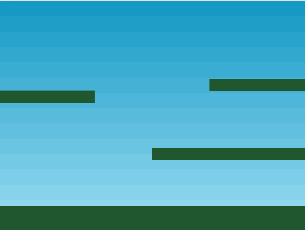
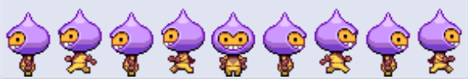
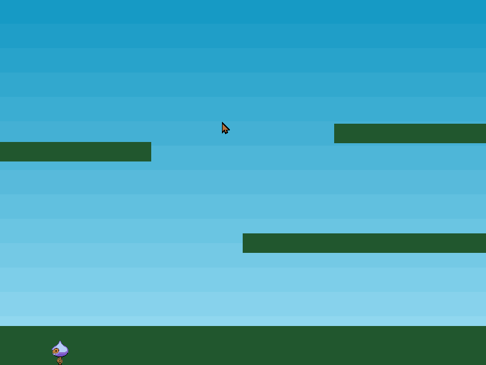
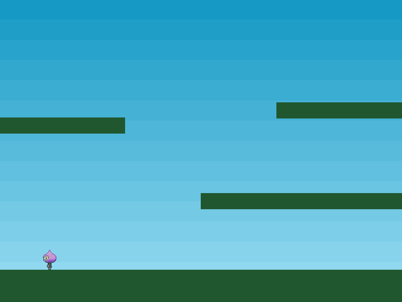
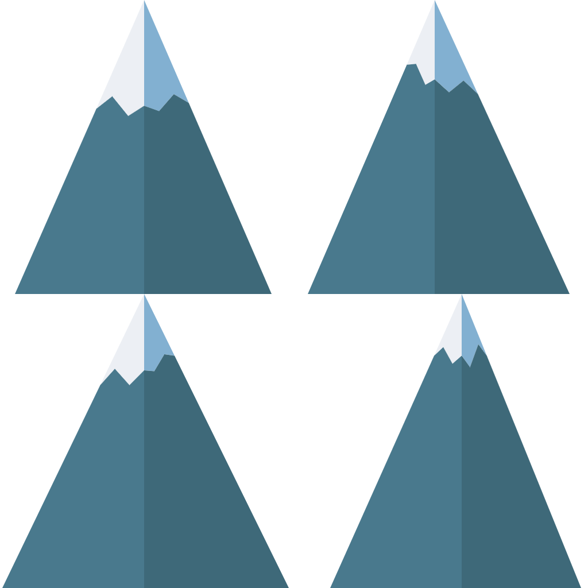

# phaser3 && arcade 物理系统

## config [配置]

```js
const config = {
    type: Phaser.AUTO, // 游戏的渲染环境
    width: 800,
    height: 600,
    scene: { // 此写法为只有一个游戏场景时，这个场景配置为
        preload: preload,
        create: create,
        update: update
    }
}

const game = new Phaser.Game(config)
```

这个 **config** 对象意味着你怎么配置 Phaser 游戏。一个 **Phaser.Game** 对象实例（instance）赋值给一个叫 `game` 的局部变量，上述配置对象传给这个实例。这将开始启动 **Phaser** 的过程。

### type

属性 `type` 可以是 `Phaser.CANVAS` ，或者 `Phaser.WEBGL` ，或者 `phaser.AUTO` 。这是你要给你的游戏使用的渲染环境（context）。**推荐 Phaser.AUTO ** ，它将自动尝试使用 WebGL ，如果浏览器或者设备不支持，它将回退为 Canvas 。Phaser 生成的画布元素（canvas element）将径直添加到文档中调用脚本的那个节点上，不过也可以在游戏配置中指定一个父容器，如果需要的话。

### width 、height

属性 `width` 和 `height` 设定了 Phaser 即将生成的画布元素的尺寸。这是游戏显示所用的分辨率。 

## 加载资源

加载游戏所需的资源。要做到这点，就要在场景中的一个叫 `preload[预加载]` 的函数内部，调用 Phaser 的 Loader（加载器）。Phaser 启动时会自动找到这个函数，并加载里面定义好的所有资源。

1. `this.load.image()` ：加载图片
2. `this.load.spritesheet()` ：加载精灵表单

```js
function preload() {
	this.load.image('sky', 'assets/sky.png')  // 加载图片，两个参数(资源的键值, 资源路径)
    this.load.image('ground', 'assets/platform.png')
    this.load.image('star', 'assets/star.png')
    this.load.image('bomb', 'assets/bomb.png')
    this.load.spritesheet('dude', 
        'assets/dude.png',
        { frameWidth: 32, frameHeight: 48 }
    )  // 加载精灵表单（sprite sheet）
}
```

资源的 **键值** 为一个任意的字符串，即为你给这个资源起的一个名字，后续要使用到这个资源时，直接使用这个键值即可。

### 显示图像

要显示已经加载的一张图像，则要将显示代码放在 `create[生成]` 函数中，代码如下：

```js
function create() {
    this.add.image(400, 300, 'sky')
}
```

`this.add.image()` ：三个参数分别为：

1. 图像坐标的 x 值
2. 图像坐标的 y 值
3. 图像资源的键值

需要注意的是，在 Phaser3 中，所有游戏对象的定位都基于它们的中心点。所以，上面代码中的 x 和 y 分别为 400 和 300，则效果如下：



若将上面代码中 x 和 y 改为 0，则我们只能看到这个图像的右下角，效果如下：



> 当然，我们也可以使用 `setOrigin[设置原点]` 来改变这种情况。如：
>
> ```js
> function create() {
>     this.add.image(0, 0, 'sky').setOrigin(0, 0)
> 	// 此时我们将这个图像定位的原点改为了左上角，因此此时我们就能看到完整的图像了
> }
> ```
>
> 效果如下：
>
> 
>
> 若此时我们将图像定位的 x 和 y 改为 400 和 300，即 `this.add.image(400, 300, 'sky').setOrigin(0, 0)` ，则只能看到图像的左上角了，效果如下：
>
> 

#### 游戏对象的显示顺序

游戏对象的显示顺序与生成它们的顺序一致。即先添加的在下，后添加的在上。代码如下：

```js
function create() {
    this.add.image(400, 300, 'sky')
    this.add.iamge(400, 300, 'star')
    // 若这两张图像添加的顺序反过来，则星星将被天空盖住
}
```

效果如下：



## 建立游戏世界

在底层，代码 `this.add.image()` 生成一个新的 **Image（图形）** 类游戏对象，并把它添加到当前场景的显示列表（display list）中。你的所有游戏对象都活在这个列表中。

### Scene[场景]

`Scene` ：自身没有确定的尺寸，在所有方向上都是无限延展的。

### Camera[镜头]

`Camera` ：系统控制着你观看场景的视野，你可以随意移动、推拉已激活的镜头。你还可以另外生成一些镜头，用于别的观看场景的视野。

### 搭建场景

```js
const platforms

function create() {
    this.add.image(400, 300, 'sky')
    
    platforms = this.physics.add.staticGroup()  // 使用 Arcade（游乐场）物理系统
    
    platforms.create(400, 568, 'ground').setScale(2).refreshBody()
    
    platforms.create(600, 400, 'ground')
    platforms.create(50, 250, 'ground')
    platforms.create(750, 220, 'ground')
}
```

`this.physics` ：代码中有一个对此方法的调用，这意味着我们在使用 **Arcade（游乐场）** 物理系统（Physics system），不过在此之前我们还需要把它添加到游戏配置中，以便告诉 Phaser 我们的游戏需要它。所以让我们更新以下，引入对物理系统的支持。如下是修订后的游戏配置：

```js
const config = {
    type: Phaser.AUTO,
    width: 800,
    height: 600,
    physics: {  // 新添加的属性
        default: 'arcade',
        arcade: {
            gravity: { y: 300 },
            debug: false
        }
    },
    scene: {
        preload: preload,
        create: create,
        update: update
    }
}
```

效果如下：



## 平台

我们刚加了一堆代码到 `create` 函数中，此函数应该更详尽地解释下，首先，`platforms = this.physics.add.staticGroup()` ：

- 这一句生成一个静态物理组（Group），并把这个组赋值给变量 **platforms** 。在 Arcade 物理系统中，有动态的和静态的两类物体（body）：

  1. 动态物体：可以通过外力，比如 `速度[velocity] | 加速度[acceleration]` 得以四处移动。可以跟其他对象发生 `反弹[bounce] | 碰撞[collide]` ，此类碰撞受物体质量和其他因素影响。
  2. 静态物体：与动态物体不同，静态物体只有位置和尺寸。

  那么上什么是 **组** 呢？如其名所示，是把近似对象组织在一起的手段，控制对象全体就像控制一个统一的个体。你也可以检查 **组** 与其他游戏对象之间的碰撞。 **组** 能够生成自己的游戏对象，这是通过便利的赋值函数如 `create` 实现的。物理组会自动生成已经开启物理系统的子项（children）。

平台组做好了，我们现在可以用它生成平台：

```js
platforms.create(400, 568, 'ground').setScale(2).refreshBody()
/* 放置地面：
   使用 create() 添加一张新的地面图像到 400 × 568 的位置，
   然后用函数 setScale(2) 将它放大到两倍，
   最后调用 refreshBody() ，这是因为缩放的是一个 静态物体 ，所有必须把所作变动告诉物理世界（physics world）*/
platforms.create(600, 400, 'ground')
platforms.create(50, 250, 'ground')
platforms.create(750, 220, 'ground')
// 放置其他平台
```

'ground' 是如下图像：


## 玩家

做一个新的变量 `player` ，并把下面的代码添加到 `create` 函数中：

```js
/* 第一部分 start */
player = this.physics.add.sprite(100, 450, 'dude') // 生成精灵 player[玩家]
player.setBounce(0.2) // 给精灵赋予 0.2 的反弹值，这表示它跳起后着地时始终会弹起一点点
player.setCollideWorldBounds(true) // 设置精灵与边界的碰撞
/* 第一部分 end */

/* 向左的 left 动画 start */
this.anims.create({
    key: 'left', // 向左的动画
    frames: this.anims.generateFrameNumbers('dude', {
        start: 0,
        end: 3
    }), // 0, 1, 2, 3 帧
    frameRate: 10, // 跑动时每秒 10 帧
    repeat: -1 // 动画要循环播放
})
/* 向左的 left 动画 end */

/* 最后一个动画键值用 'true' */
this.anims.create({
    key: 'turn',
    frames: [{key: 'dude', frame: 4}],
    frameRate: 20
})

/* 向右的 right 动画 start */
this.anims.create({
    key: 'right',
    frames: this.anims.generateFrameNumbers('dude', {
        start: 5,
        end: 8
    }),
    frameRate: 10,
    repeat: -1
})
/* 向右的 right 动画 end */
```

这里有两件不同的事情：生成物理精灵（sprite），生成精灵能用到的几个动画。

### 物理精灵

上面代码第一部分生成精灵 `player[玩家]` ，位于 100 × 450 位置。精灵是通过物理游戏对象工厂函数（即 `this.physics.add` ）生成的，这意味着它默认拥有一个动态物体。

精灵生成后，被赋予 0.2 的一点点反弹值。然后精灵设置了与世界边界（bound）的碰撞。

### 动画

如果回顾一下 `preload` 函数，就会发现 'dude' 是作为精灵表单（sprite sheet）载入的，而非图像。这是因为它包含了动画帧。完整的精灵表单如下：



总共有 9 帧，4 帧向左跑动，4 帧向右跑动，一帧面向镜头。

> 注：Phaser 支持翻转精灵，以节省动画帧，不过因为这是个案例，所以保持老派做法。

定义两个动画，分别为 **lfet** 和 **right** 。

left 动画使用 0, 1, 2, 3 帧，跑动时每秒 10 帧。'repeat: -1' 告诉动画要循环播放。

这是标准跑动周期。反方向的动画把这些重复一下，键值用 'right' 。最后一个动画键值用 'turn'（转身）。

> **补充信息** ：在 Phaser3 中，动画管理器（Animation Manager）是全局系统。其中生成的动画是全局变量，所有游戏对象都能用到它们。它们分享基础的动画数据，同时管理自己的时间轴（timeline）。这就使我们能够在某时定义一个动画，却可以应用到任意多的游戏对象上。

## 添加物理系统

Phaser 支持多种物理系统，每一种都以插件的形式运作，任何 Phaser 场景都能使用它们。在本文写作时，已经装有 Arcade ，Impact ，Matter.js 三种物理系统。针对本教程，我们将给我们的游戏使用 Arcade 物理系统，它简单，轻量，完美地支持移动浏览器。

物理精灵在生成时，即被赋予 `body[物体]` 属性，这个属性指向它的 Arcade 物理系统的 Body 。它表示精灵是 Arcade 物理引擎的一个物体。物体对象有很对属性和方法，我们可以玩一下。

如， **在一个精灵上模仿重力效果** ，可以这么简单写： `player.body.setGravityY(300)` 。这是个随意的值，值越大，你的对象感觉越重，下落越快。将其加到代码里，你会看到玩家不停往下落，完全无视先前生成的地面：



原因在于，我们还没有测试地面和玩家之间的碰撞。

我们已经能够告诉 Pharse ，地面和平台是静态物体，但是我们这样做，反而生成了动态的。如此，当玩家和它们碰撞时，玩家会停止一瞬，然后全部崩溃。这是因为，除非别那么做，否则地面是会移动的物体，当玩家碰到它时，碰撞导致的力会作用于地面，因此两个物体交换彼此的速度，于是地面也开始下落。

要想玩家能与平台碰撞，我们可以生成一个碰撞对象。该对象监控两个物体（可以是组），检测二者之间的碰撞和重叠事件。如果发生事件，这时它可以随意调用我们的回调函数。不过仅仅就与平台间的碰撞而言，我们没必要那么做： `this.physics.add.collider(player, platforms)` 。

**碰撞器（Collider）** 是施魔法的地方。 <span style="color: red">它接收两个对象，检测二者之间的碰撞，并使二者分开</span> 。在本例中，我们把玩家精灵和平台组交给它。它很聪明，可以执行针对所有组成员的碰撞，所以这一个调用就能处理与组合以及所有平台的碰撞。结果就有了一个稳固的平台，不再崩塌：



## 键盘控制

Phaser 有内置的键盘管理器，用它的一个好处体现在这样一个方便的小函数： `cursors = this.input.keyboard.createCursorKeys()` 。

这里把四个属性 `up | down | left | right` （都是 Key 对象的实例），植入光标（cursor）对象。然后我们要做的就是 `update` 循环中做这样一些轮询：

```js
var cursors = null
function update () {
    cursors = this.input.keyboard.createCursorKeys() // Phaser 内置的键盘管理器
	if (cursors.left.isDown) {  // 向左移动，isDown 检测按键是否被按下
	    player.setVelocityX(-160)
	    player.anims.play('left', true)
	} else if (cursors.right.isDown) {  // 向右移动
	    player.setVelocityX(160)
	    player.anims.play('right', true)
	} else {  // 静止
	    player.setVelocityX(0)
	    player.anims.play('turn')
	}
	
	if (cursors.up.isDown && player.body.touching.down) {  // 跳跃
	    player.setVelocityY(-330)
	}
}
```

上面代码第一件事是使用 Phaser 内置的键盘管理器，然后检测方向键的 left 、right 和 up 是否被按下。

代码的最后部分添加了跳跃功能。方向键 up 是跳跃键，我们检查它有没有被按下，同时也检测玩家是不是正与地面接触，这样可以放置玩家一直在空中向上跳跃。

当这些条件都符合，我们应用一个垂直速度，330px 每秒。玩家会自动落回地面，因为有重力。

## 收集星星

现在让我们撒几颗星星到场景中，让玩家来收集。要做到这一点，我们要生成一个新的组，叫 **star** ，再充实它。在生成函数中，我们加入如下代码：

```js
// 第一段代码
star = this.physics.add.group({
    key: 'star',
    repeat: 11,
    setXY: {
        x: 12,
        y: 0,
        stepX: 70
    }
})

// 第二段代码
stars.children.iterate(function (child) {
    child.setBounceY(Phaser.Math.FloatBetween(0.4, 0.8))
})
```

这个过程跟我们生成平台近似。因为需要星星移动、反弹，我们生成动态物理组，而不是静态的。

组可以接收配置对象，以便于设置。在本例中，组配置对象（第一段代码）有 3 个部分：

1. 首先，它设置 `key`（键值）为星星图像。这意味着配置对象生成的所有子项，都将被默认地赋予星星图像。
2. 然后，它设置 `repeat` （重复值）为 11。因为它自动生成一个子项，重复 11 次就意味着我们总共将得到 12 颗。
3. 最后，用 `setXY` 设置组的 12 个子项的位置。每个子项都将如此放置：
   - 初始是 `{x: 12, y: 0}` 
   - 然后 x 步进 70 `{x: 82, y: 0}` 
   - 后续每个都依次类推。

第二段代码遍历组中所有子项，给它们的 `bounce.y` 赋予 0.4 到 0.8 之间的随机值，反弹范围在 0 [不反弹] 到 1 [完全反弹] 。因为星星都是在 y 等于 0 的位置产出的，重力将把它们往下拉，直到与平台或地面碰撞为止。反弹值意味着它们将随机地反弹上来，直到最终恢复安定为止。

<span style="color: gray">如果现在我们这样就运行代码，星星会落下并穿过游戏底边，消失不见了。要防止这个问题，我们就要检测它们与平台的碰撞。我们可以再使用一个碰撞器对象来做这件事：</span> 

`this.physics.add.collider(stars, platforms)` 

与此类似，我们也将检测万家是否与星星重叠： `this.physics.add.overlap(player, stars, collectStar, null, this)` 。

这会告诉 Phaser ，要检查玩家与组中任何一颗星星的重叠。如果检测到，它们就会被传送到 `collectStar` 函数：

```js
function collectStar(player, star) {
    star.disableBody(true, true)
}
```

> 简单的说，星星带着个已关闭的物体，其父级游戏对象被设置为不会动、不可见，即将它从显示中移除。

## 计分

为了做得分，我们将使用游戏对象 `Text(文本)` 。在此我们生成两个新的变量：

```js
let score = 0  // 实际得分
let scoreText  // 文本对象本身 
```

`scoreText` 在 `create` 函数中构建：

```js
function create() {
    ...
    scoreText = this.add.text(16, 16, 'score: 0', { fontSize: '32px', fill: '$000'})
    /* 
    	参数一和参数二是显示文本的坐标位置。
    	参数三是要显示的默认字符串。
    	参数四是一个对象，包含字号、填充色。因为没有指定字体，实际上将使用 Phaser 默认的字体。
    */
    ...
}
```

然后调整 `collectStar` 函数，以便玩家捡到一颗星星时分数会提高，文本会更新已反映出新状态：

```js
function collectStar(player, star) {
    star.disableBody(true, true)
    
    score += 10
    scoreText.setText('Score: ' + score)
}
/*
	这样一来，每颗星星加 10 分，scoreText 将更新，显示出新的总分。
*/
```

## 敌人

添加的敌人的逻辑是这样的：

<span style="color: gray">第一次收集到所有星星后，将放出一个跳跳弹。这个炸弹只是随机的在平台上各处跳，如果碰到它，角色死亡。每次收集完星星之后，将会重新产出所有星星，且多产生一个跳跳弹。</span> 

我们首先需要的是给炸弹一个组，还有碰撞器：

```js
function create() {
    ...
    bombs = this.physics.add.group()
    this.physics.add.collider(bombs, platforms)
    this.physics.add.collider(player, bombs, hitBomb, null, this)
}
```

炸弹当然会跳出平台，如果玩家碰到它们，我们将调用 `hitBomb` 函数。这个函数所作的就是停止游戏，使玩家变成红色：

```js
function hitBomb(player, bomb) {
    this.physics.pause()
    player.setTint(0xff0000)
    player.anims.play('turn')
    gameOver = true
}
```

现在看来还不错，不过我们要放出一个炸弹。要做到这一点，我们改一下 `collectStar` 函数：

```js
function collectStar(player, star) {
    star.disableBody(true, true)
    
    score += 10
    scoreText.setText('Score: ' + score)
    
    if (stars.countActive(true) === 0) {
        stars.children.iterate(function (child) {
            child.enableBody(true, child.x, 0, true, true)
        })
        
        let x = (player.x < 400) ? Phaser.Math.Between(400, 800) : Phaser.Math.Between(0, 400)
        
        let bomb = bomb.create(x, 16, 'bomb')
        bomb.setBounce(1)
        bomb.setCollideWorldBounds(true)
        bomb.setVelocity(Phaser.Math.Between(-200, 200), 20)
    }
}
```

我们使用一个组的方法 `countActive` ，看看有多少星星还活着。如果没有了，那么玩家把它们收集完了，于是我们使用迭代函数重新激活所有星星，重置它们的 y 位置为 0 。这将使所有星星再次从画面顶部落下。

下一部分代码生成一个炸弹。首先，我们取一个随机 x 坐标给它，始终在玩家的对侧画面，以便给玩家个机会。然后生成炸弹，设置它跟世界碰撞、反弹，拥有随机速度。

## 监听键盘按键

代码如下：

```js
let keyA = null // 按键 A
let key5 = null // 按键 5
let keySpace = null // 按键 space 空格
let keyLeft = null // 按键 left 方向键左键
create() {
    keyA = this.input.keyboard.addKey(Phaser.Input.Keyboard.KeyCodes.A) // 保存按键 A
    key5 = this.input.keyboard.addKey(Phaser.Input.Keyboard.KeyCodes.FIVE) 
    // 保存按键 5
    keySpace = this.input.keyboard.addKey(Phaser.Input.Keyboard.KeyCodes.SPACE) 
    // 保存按键 space 空格
    keyLeft = this.input.keyboard.addKey(Phaser.Input.Keyboard.KeyCodes.LEFT) 
    // 保存按键 left 方向键左键
}
update() {
    if (keyA.isDown) { // 判断按键 A 是否被按下
        console.log('A')
    }
    
    if (key5.isDown) { // 判断按键 5 是否被按下
        console.log('5')
    }
    
    if (keySpace.isDown) { // 判断按键 SPACE 空格 是否被按下
        console.log('SPACE')
    }
    
    if (keyLeft.isDown) { // 判断按键 LEFT 方向键左键 是否被按下
        console.log('LEFT');
    }
}
```

## 获取鼠标点击的坐标

代码如下：

```js
create() {
    this.input.on('pointerdown', function (pointer) { // 点击事件
        console.log('pointer.x', pointer.x) // 点击的 x 轴坐标
        console.log('pointer.y', pointer.y) // 点击的 y 轴坐标
    }, this)
}
```

## 鼠标松开

```js
this.input.on('pointerup', function (pointer) {
    console.log('pointerup')
})
```

## 设置对象的缩放

`.setScale(alpha)` ：控制精灵的缩放

```js
let obj = this.add.tileSprite(x坐标, y坐标, 宽度, 高度, '纹理图片的 key').setScale(alpha)
let OBJ = this.physics.add.sprite(x坐标, y坐标, '纹理图片的key').setScale(alpha)
```

## 设置对象的层级

`.setDepth(number)` ：设置对象的层级，可以理解为 CSS 中的 **z-index** 属性。

- 使用方式与上面方法相同

## 设置对象的旋转 2D

`.setRotation(number)` ：设置对象的旋转，参数 number 为弧度制。

- `.setRotation(1.56)` ：对象旋转 90° 。

`.setAngle(number)` ：设置对象的旋转，参数 number 为角度制。

- `.setAngle(90)` ：对象旋转 90° 。

## 设置对象定位的中心点位置

`.setOrigin(alpha, alpha)` ：设置对象定位的中心点位置，默认位置为对象(50%, 50%) 位置。

- `.setOrigin(0.5, 1)` ：将对象定位的中心点位置为 x 轴 50% 位置，y 轴 100% 位置。

## 将游戏对象挂载到物理引擎上

`this.physics.add.existing()` ：将游戏对象挂载到物理引擎上

```js
let obj = this.add.tileSprite(x坐标, y坐标, 宽度, 高度, '纹理图片的 key')
this.physics.add.existing(obj)

let OBJ = this.physics.add.sprite(x坐标, y坐标, '纹理图片的key')
this.physics.add.existing(OBJ)
```

## 设置对象移动的速度

`.setVelocityX(number)` ：设置对象在 x 轴方向上的速度。

`.setVelocityY(number)` ：设置对象在 y 轴方向上的速度。

```js
let obj = this.add.tileSprite(x坐标, y坐标, 宽度, 高度, '纹理图片的 key')
this.physics.add.existing(obj)
obj.body.setVelocityY(200)

let OBJ = this.physics.add.sprite(x坐标, y坐标, '纹理图片的key')
this.physics.add.existing(OBJ)
OBJ.body.setVelocityX(200)
```

## 获取对象移动的速度

```js
let obj = this.add.tileSprite(x坐标, y坐标, 宽度, 高度, '纹理图片的 key')
this.physics.add.existing(obj)
console.log('velocityX', obj.body.velocity.x) // 输出 x 轴方向上的移动速度

let OBJ = this.physics.add.sprite(x坐标, y坐标, '纹理图片的key')
this.physics.add.existing(OBJ)
console.log('velocityY', obj.body.velocity.y) // 输出 y 轴方向上的移动速度
```

## 设置要渲染的帧

`.setFrame(number)` ：设置要渲染的帧，要渲染的对象使用的图片为精灵图，如下：



<p style="width: 100%;text-align: center;color: gray;">图1</p>


<p style="width: 100%;text-align: center;color: gray;">图2</p>

## 设置对象是否可以通过碰撞移动

`.setImmovable(boolean)` ：设置对象是否可以通过碰撞移动，默认为 true。

- 即有速度的物体碰撞无速度的物体会带动无速度的物体移动

## 设置对象受到的重力

`.setGravityX(number)` ：设置对象在 x 轴方向上受到的重力。

`.setGravityY(number)` ：设置对象在 y 轴方向上受到的重力。

> 对象需挂载到物理引擎上 `this.physics.add.existing()` 。

## 控制游戏暂停和继续

`game.scene.pause(游戏场景[string])` ：暂停某个游戏场景

`game.scene.resume(游戏场景[string])` ：继续某个游戏场景

代码如下：

```js
game = new Phaser.Game(gameConfig)
class playGame extends Phaser.Scene {
    constructor() {
        super('PlayGame')
    }
    preload() {}
    create() {}
    update() {}
}
...
game.scene.pause('PlayGame')
...
game.scene.resume('PlayGame')
```

## 控制游戏开始与结束

`game.scene.start(游戏场景[string])` ：开始某个游戏场景

`game.scene.stop(游戏场景[string])` ：结束某个游戏场景

```js
game = new Phaser.Game(gameConfig)

class preloadGame extends Phaser.Scene {
    constructor() {
        super('PreloadGame')
    }
    preload() {}
    create() {
        ...
        game.scene.start('PlayGame')
    }
}

class playGame extends Phaser.Scene {
    constructor() {
        super('PlayGame')
    }
    preload() {}
    create() {}
    update() {
        ...
        game.scene.stop('PlayGame')
    }
}
```

## 游戏配置

```js
let width = $(window).width()
let height = $(window).height()
let gameConfig = {
    type: Phaser.AUTO,
    width,
    height,
    scene: [preloadGame, startGame, playGame, endGame],
    // scene 为一个数组，其中参数为各个继承自 Phaser.Scene 的游戏场景
    parent: 'game', // 生成的 canvas 要插入哪个 DOM 结构中
    physics: { // 物理设置
        default: 'arcade'
    },
}
game = new Phaser.Game(gameConfig)
```

## 向场景中添加文字

`this.add.text(x轴位置, y轴位置, '要显示的文字', {文本的样式})` ：生成文本

`.setText(要显示的文字[string])` ：更新文本

```js
let text = this.add.text(width / 2, height / 2, '提示', {
    fontSize: '0.2rem',
    fill: '#fff'
}
...
text.setText('提示')
```

## 加载音频和播放音频

`this.load.audio(key[string], src[string])` ：加载音频。

`this.sound.add(key[string])` ：添加音频。

`.addMarker(markerConfig)` ：在当前声音中添加一个标记。标记由名称、开始时间、持续时间和可选的配置对象表示。这样可以将多个声音捆绑到一个音频文件中，并使用标记在它们之间跳转进行播放。

`.play('loop', {delay: 0})` ：循环播放音乐，延迟时间为 0 。

```js
preload() {
    this.load.audio('bgm', ./bgm/bgm.mp3)
}

create() {
    let markerConfig = {
        name: 'loop',
        start: 0, // 开始时间
        duration: 21, // 音频持续时间
        config: {
            loop: true // 开启循环
        }
    }
    this.bgm = this.sound.add('bgm')
    this.bgm.addMarker(markerConfig)
    this.bgm.play('loop', {delay: 0})
}
```

## Phaser.Physics.Arcade.Sprite

`this.physics.add.sprite(x轴位置, y轴位置, key[string])` ：**Arcade Physics Sprite** 是具有 **Arcade Physics** 主体和相关组件的 **Sprite** 。它可以是动态的，也可以是静态的。**Arcade Sprite** 和 **Arcade Image** 之间的主要区别在于您不能为 **Arcade Image** 设置动画。如果不需要动画，那么可以使用 **Arcade Image** 而不是 **Arcade Sprites** 。

## Phaser.GameObjects.TileSprite

`this.add.tileSprite(x轴位置, y轴位置, 宽度, 高度, key[string])` ：**TileSprite** 是具有重复纹理 **Sprite** 。纹理可以独立于 **TileSprite** 本身进行滚动和缩放。纹理将自动环绕，以便可以使用无缝纹理作为源创建游戏背景。

- 不要创建一个比实际画布尺寸大的 TileSprite 。如果想创建一个在整个游戏地图上滚动的大型重复背景，那么可以创建一个适合画布大小 TileSprite ，然后使用该 *tilePosition* 属性在玩家移动时滚动纹理。如果创建一个大小为数千像素的 TileSprite ，那么它将消耗大量内存并导致性能问题。

> 用 *tilePosition* 滚动纹理，用 *tileScale* 调整纹理的比例。不要调整精灵本身的大小来使其大于需要的大小。

## 播放动画

创建动画：

```js
create() {
    this.anims.create({ // 创建动画
  		key: 'rotate', // 动画的名称
  		frames: this.anims.generateFrameNumbers('coin', {
    		start: 0,
    		end: 5,
  		}), // 设置动画要使用的图片 和 动画的总帧数
  		frameRate: 15, // 设置每秒的帧数
  		yoyo: true, // 动画完成后是否回头重新播放，默认 false
  		repeat: -1, // 重复执行
	})
}
```

播放动画：

```js
obj.anims.play('rotate') // 播放动画
```

##   停止动画

停止动画：

```js
obj.anims.stop()
```

## 获取组的长度

`.getLength()` ：获取组的长度

## 获取组中的所有成员

`.getChildren()` ：获取组中所有成员

## 获取组中第一个成员

`.getFirst()` ：获取组中第一个成员

## 从组中移除一个成员

`.remove()` ：从组中移除一个成员

## 补间动画 Tween

`this.tweens.add(config)` ：创建一个补间动画

[config 配置](https://newdocs.phaser.io/docs/3.55.2/Phaser.Types.Tweens.TweenBuilderConfig) 

```js
// tweens 可配置参数一览
this.tweens.add({
    targets: [sprite1, sprite2, sprite3], // 允许单个或多个游戏对象
    paused: false, // 初始是否为暂停状态
    callbackScope: tween,
    
    onStart: function() { }, // 开始时执行回调
    onStartScope: callbackScope,
    onStartParams: [],
    
    delay: 0, // 第一次播放前的停顿时长
    
    duration: 1000, // 动画总时长
    ease: 'Linear', // 提供了多达 44 种动画速度曲线
    easeParams: null, // 速度曲线的参数
    
    onUpdate: function() { }, // 补间更新时执行回调
    onUpdateScope: callbackScope,
    onUpdateParams: [],

    hold: 0, // 反向播放前停顿的时长
    yoyo: false, // 是否反向播放
    flipX: false, // 动画结束后，元素是否 X 轴翻转
    flipY: false, // 动画结束后，元素是否 Y 轴翻转
    onYoyo: function() { }, // 反向播放时执行回调
    onYoyoScope: callbackScope,
    onYoyoParams: [],
    
    repeat: 0, //重复播放次数，-1 : infinity
    onRepeat: function() { }, // 重复播放时执行回调
    onRepeatScope: callbackScope,
    onRepeatParams: [],
    repeatDelay: 0, // 重复播放之前停顿的时长

    loop: -1, // 循环次数 -1 : infinity
    onLoop: function() { }, // 循环播放时执行回调
    onLoopScope: callbackScope,
    onLoopParams: [],
    loopDelay: 0, // 停顿多久的时长进入下一次循环
	
    completeDelay: 0, // 动画完成前的停顿时间
    onComplete: function () {}, // 动画结束后执行回调
    onCompleteScope: callbackScope,
    onCompleteParams: [],
    
    // 属性值
    x: '+=600',
    y: 500,
    rotation: ...,
    angle: ...,
    alpha: ...,
    // ...
    
    // 或者
    props: {
        x: { value: '+=600', duration: 3000, ease: 'Power2' }
        y: { value: '500', duration: 1500, ease: 'Bounce.easeOut' }
    },
    
    // 又或者
    props: {
        x: {
            duration: 400,
            yoyo: true,
            repeat: 8,
            ease: 'Sine.easeInOut',
            value: {
                getEnd: function (target, key, value) {
                    destX -= 30
                    return destX
                },
                getStart: function (target, key, value) {
                    return value + 30
                }    
            }
        },
        // ....
    },
    offset: null, 
    useFrames: false, // 使用帧或是毫秒
})
```

### ease 的值

[缓动参数](https://blog.csdn.net/sllailcp/article/details/122601215) 

## 设置两个对象的碰撞

`this.physics.add.collider(obj, obj, function(){}, null, this)` ：碰撞器

> 碰撞函数会被触发很多次，如果要在碰撞器的回调函数中执行只需要触发一次的事件，则需要给其上锁。

## 设置两个对象的重叠

`this.physics.add.overlap(obj, obj, function(){}, null, this)` ：重叠器

> 重叠函数会被触发很多次，如果要在回调函数中执行只需触发一次的事件，则需要给其上锁。

## 移除 / 添加(恢复)碰撞器

`this.physics.world.removeCollider(collider)` ：移除碰撞器。

`this.physics.world.colliders.add(collider)` ：添加（恢复）碰撞器。

```js
let collider = this.physics.add.collider(obj, obj, function(){}, null, this)
...
this.physics.world.removeCollider(collider) // 移除碰撞器
...
this.physics.world.colliders.add(collider) // 添加碰撞器
```

## 对象的某一面(上/下/左/右)，触碰到其他东西

`.body.touching.left` ：左面触碰。

```js
create() {
    this.player = this.physics.add.sprite(x, y, 'player')
}

update() {
    if (this.player.body.touching.left) {
        console.log('touching')
    }
}
```

## 获取 / 设置对象的 x 和 y 轴的位置

```js
update() {
    console.log(this.obj.x) // 获取 obj 的 x 轴的位置
    console.log(this.obj.y) // 获取 obj 的 y 轴的位置
    
    this.OBJ.x = this.obj.x // 设置 OBJ 的 x 为 obj 的 x 轴位置
    this.OBJ.y = this.obj.y // 设置 OBJ 的 y 为 obj 的 y 轴位置
}
```

## 设置游戏世界边缘碰撞

`.setCollideWorldBounds(true)` ：开启游戏世界边缘碰撞。

```js
...
this.player = this.physics.add.sprite(x, y, 'player')
this.player.setCollideWorldBounds(true)
```

## 设置碰撞回弹系数

`.setBounds(x, y)` ：设置回弹系数。

```js
...
this.player = this.physics.add.sprite(x, y, 'player')
this.player.setBounds(1)
```

 ## 设置物体的可见性

```javascript
this.player = this.add.image(x, y, 'player')
this.player.setVisible(false) // false 为不可见
this.player.visible = true // true 为可见
```

## 设置多指点击

```javascript
this.input.addPointer(2) // 添加多指点击，这个为二指

const btn1 = this.add.image(x, y, 'btn1')
btn1.setInteractive() // 开启这个对象的点击事件
const btn2 = this.add.image(x, y, 'btn2')
btn2.setInteractive()

this.input.on('gameobjectdown', function(pointer, gameobject){
  // gameobject 为用户点击的这个对象
  if (gameobject.texture.key === 'btn1') { ... } // 这里判断点击的是否为btn1
  if (gameobject.texture.key === 'btn2') { ... } // 这里判断点击的是否为btn2
}, this)
```

## 解决画面在手机上过于模糊的问题

我们可以将作画的画布放大一定倍数，这里建议2~3倍，过大会导致画面掉帧卡顿。

```javascript
const CANVASSCALE = 3
const WIDTH = window.innerWidth * CANVASSCALE
const HEIGHT = window.innerHeight * CANVASSCALE

const game_config = {
  type: Phaser.AUTO,
  width: WIDTH,
  height: HEIGHT,
  scene: [], // 场景
  parent: 'game', // 生成的canvas的父级
  physics: {
    default: 'arcade'
  },
}
const GAME = new Phaser.Game(game_config)
```

然后，我们在css文件中，将这个canvas缩小相应倍数。

```css
canvas {
  transform: scale((1 / 3));
  transform-origin: 0 0;
}
```

## 通过判断物体的边缘是否相交判断物体是否重叠

```javascript
// 检查音符与得分区域是否重叠
CheckOverlap(object1, object2) {
  const obj1Bounds = object1.getBounds() // 获取第一个obj边缘
  const obj2Bounds = object2.getBounds() // 获取第二个obj边缘
  // 检测两个边缘是否相交，这里判断的是两个长方形边缘，返回值为 boolean
  return Phaser.Geom.Intersects.RectangleToRectangle(obj1Bounds, obj2Bounds)
}
```

## 设置延迟执行

这个延迟执行可以理解为定时器

```javascript
this.time.delayedCall(time, function() {}, [], this)
// time 单位 ms
```

## 获取物体的某个角的坐标

```javascript
this.object = this.add.image(x, y, 'object')

this.object.getTopLeft() // 获取左上角坐标
this.object.getTopRight() // 获取右上角坐标
this.object.getBottomLeft() // 获取左下角坐标
this.object.getBottomRight() // 获取右下角坐标
this.object.getTopLeft().x // 获取左上角的 x 坐标
```

