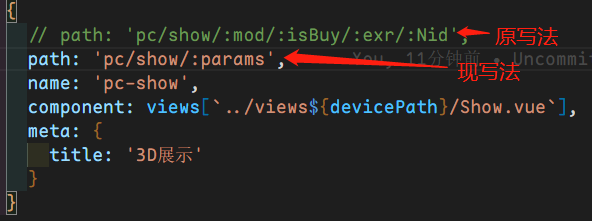
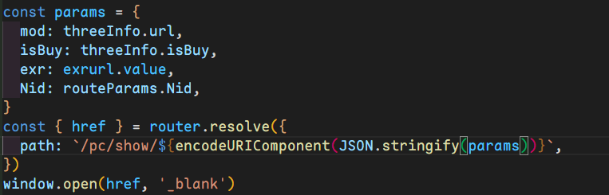
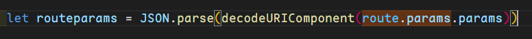
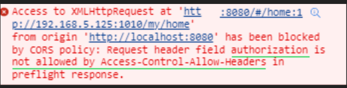

# 问题及解决方法

## 1、路由跳转白屏问题

- 问题：我此处遇到的问题是因路由中携带太多参数，而传递时某些参数为空导致路由中存在`双斜线(//)`的问题，因此页面白屏。

  

- 解决办法：

  1. 将路由文件中多参数集合为单参数

  2. 路由传递时：

     

  3. 路由接收时：

     


# 其他

## 1、通过token是否存在来判断是否重定向到其他页面

1. 在 route 文件中有`/ 重定向到 login 的配置`

2. `token` 保存在 `localStorage` 中

3. 在 route 的 `index.js` 文件中做全局路由守卫

   ```JavaScript
   router.beforeEach((to, from, next) => {
     if (to.name == 'login' && localStorage.getItem('token')) {
       next({name: 'home'})
     } else {
       next()
     }
   })
   ```

## 2、在 node.js 中生成和解析 token

1. 使用 `jsonwebtoken` 插件，生成 JWT 的 token 字符串

2. 使用 `express-jwt` 插件，解析前端发送的 token 字符串

   - 该插件解析的是保存在 `Authorization` 中的 token

   [生成和解析token](https://www.cnblogs.com/wjy00/p/15916738.html) 

3. 在前端请求时在请求头中使用 `Authorization` 携带 token

   - 这里可能会报错：

     

   - 这个报错的意思是 `Authorization` 在 `Access-Control-Allow-Headers` 中没有被允许携带

   - 解决办法：在后端接口文件的 `app.js` 中添加以下代码：

     ```JavaScript
     const app = express()
     
     app.all('*', (req, res, next) => {
       res.header('Access-Control-Allow-Origin', '*')
       res.header('Access-Control-Allow-Headers', 'Authorization, Content-Type, Content-Length, Accept, X-Requested-With, sessionToken')
       // 这里的 sessionToken 为自定义的一个请求头
       res.header('Access-Control-Allow-Methods', 'PUT, POST, GET, DELETE, OPTIONS') // 这里也可以直接写 * 允许所有
       // 设置 options 请求快速响应
       if (req.methd.toLowerCase() === 'options') {
         res.send(200)
       } else {
         next()
       }
     })
     ```


## 3、使用自定义指令实现搜索框自动聚焦

```vue
<script setup>
// 在模板中启用 v-focus
const vFocus = {
  mounted: (el) => el.focus()
}
</script>

<template>
  <input v-focus />
	<!-- 这种指令写法比 `autofocus` attribute 更有用，因为不仅可以在页面加载完成后生效，还可以在 Vue 动态插入元素后生效 -->
</template>
```

[指令钩子](https://cn.vuejs.org/guide/reusability/custom-directives.html#directive-hooks) 

## 4、在 Vue3 中使用 Element-plus

这里为全局注册进行使用。

1. 导入组件

   `import { ElRow, ElCol, ElCard, ... } from 'element-plus'` 

2. 导入样式

   `import 'element-plus/dist/index.css'` 

3. 导入 icon 图标，如果需要使用的话

   `import { Plus, ZoomIn, Download, ... } from '@element-plus/icons-vue'` 

4. 在 `main.js` 文件中全局注册

   ```JavaScript
   import { createApp } from 'vue'
   import App from './App.vue'
   ... // 导入组件、样式等
   
   const app = createApp(App)
   
   // 全局注册
   const ElComponents = [ElRow, ElCol, ElCard]
   ElComponents.forEach(item => {
     app.use(item)
   })
   const ElIcons = [Plus, ZoomIn, Download]
   ElIcons.forEach(item => {
     app.use(item)
   })
   
   app.mount('#app')
   ```

5. 使用

   ```vue
   <template>
   	<!-- 使用组件 -->
   	<el-row :gutter="10">
   		<el-col :span="12">
   			<el-card>
   			 <!-- 使用icon图标 -->
           <el-icon> <Plus /> </el-icon> 
     		</el-card>
     	</el-col>
     </el-row>
   </template>
   ```

## 路由

`src/router/index.js` 

```JavaScript
// 导入创建路由的方法
/*
	createWebHashHistory：哈希历史模式
	createWebHistory：H5历史模式
	这两个模式二选一进行创建
*/
import { createRouter, createWebHashHistory, createWebHistory } from 'vue-router'
// 导入路由页面，导入 src/views/ 文件夹下的所有 vue 文件
const views = import.meta.glob('../views/**/*.vue')
// 定义路由路径
const routes = [
  {
    path: '/',
    name: 'main',
    component: views['../views/Main.vue'],
    children: [
      {
        path: '',
        name: 'home',
        component: views['../views/Home.vue'],
        meta: {
          title: '首页'
        }
      },
      ... // 其他子路由
    ]
  },
  ... // 其他路由
]
    
const router = createRouter({
  routes,
  history: createWebHashHistory()
})

export default router
```

[vue-router官方文档](https://router.vuejs.org/zh/introduction.html) 
