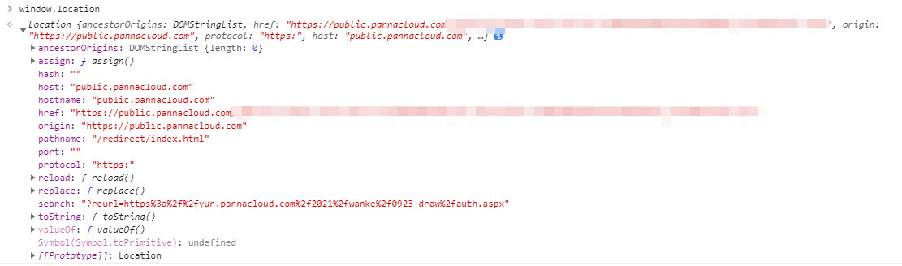
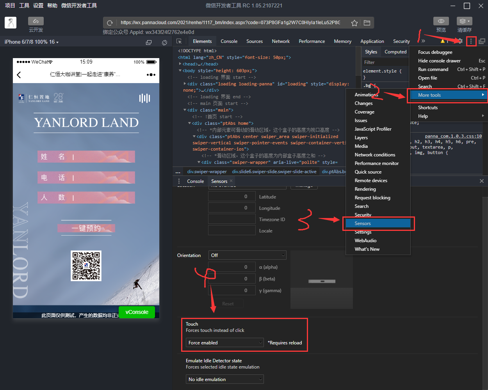

# 保利测试 H5

## canvas 画图

1. 需要绘制图片时：

   ```html
   <div>
   	<canvas id="cvs" width="750" height="1"></canvas>
   </div>
   
   <script>
   	const cvs = $('#cvs')[0]  // 获取 canvas 标签
   	const ctx = cvs.getContext('2d')  // 获得 2d 上下文对象
   	const bg = new Image()  // 实例化一个图片对象
       bg.crossOrigin = "anonymous"
       // 解决 canvas 受污染无法使用 toDataURL 方法导出图像的问题
   	bg.onload = function() {
       	ctx.drawImage(bg, 左上角 x 轴位置, 左上角 y 轴位置, 宽度, 高度)
   	}
   	bg.src = '图片资源地址'
   </script>
   ```

   

2. 将方形图片裁剪为圆形图片：基本思路就是先画一个圆形，然后将圆形封闭起来，裁剪掉周围部分，盖在方形图片上，此时方形图片超出圆形范围的部分就不会被显示，看起来就是一张圆形的图片。

   ```js
   const img = new Image()
   
   img.onload = function() {
       var width = img.width;  // 获取图片的宽度
       var height = img.height;  // 获取图片的高度
       var circle = {
           x: width / 2,
           y: height / 2,
           r: width / 2
       }  // 设置将要画的圆形的 (x, y) 坐标和半径
       
       //开始路径画圆,剪切处理
   	ctx.save()  // 是 Canvas 2D API 通过将当前状态放入栈中，保存 canvas 全部状态的方法。
   	ctx.beginPath()
       // 是 Canvas 2D API 通过清空子路径列表开始一个新路径的方法。
       // 当你想创建一个新的路径时，调用此方法。
   	ctx.arc(圆心的 x 轴坐标, 圆心的 y 轴坐标, 半径, 0, Math.PI * 2)  // 画一个圆形
   	ctx.closePath()  
       // 是 Canvas 2D API 将笔点返回到当前子路径起始点的方法。
       // 它尝试从当前点到起始点绘制一条直线。
       // 如果图形已经是封闭的或者只有一个点，那么此方法不会做任何操作。
   	ctx.clip(); // 是 Canvas 2D API 将当前创建的路径设置为当前剪切路径的方法。
   	ctx.drawImage(img, 左上角 x 轴位置, 左上角 y 轴位置, 宽度, 高度)  // 画图片
   	ctx.restore()
       // 是 Canvas 2D API 通过在绘图状态栈中弹出顶端的状态。
       // 将 canvas 恢复到最近的保存状态的方法。 如果没有保存状态，此方法不做任何改变。
   }
   img.src = '图片资源路径'
   ```

   

3. 绘制实体文字：

   ```js
   function() {
       ctx.save()
       ctx.font = "32px HYQiHei"  // 字体大小和字体类型（默认为 serif）
       ctx.fillStyle = "#ffffff"  // 字体颜色
       ctx.fillText(文本内容, 离左侧的距离, 文字的 baseline 离上方的距离)  
       // 绘制实体文本
       ctx.restore()
   }
   ```

   

## 刷新当前网站

`location.reload()` 

## jQuery

### .on()

`on('click', function() {})` ：点击事件，回调函数中写发生的事情。

### .fadeIn()

`fadeIn(执行时间-单位毫秒, function() {})` ：页面淡入，回调函数中写发生的事情。

### .fadeOut()

`fadeOut()`  ：页面淡出，与 `fadeIn` 写法一致。

### .addClass()

`addClass(类名-string)` ：给元素添加一个类。

### .removeClass()

`removeClass(类名-string)` ：给元素删除一个类。

### .remove()

`remove()` ：移除被选元素，包括所有的文本和子节点。

该方法也会移除被选元素的数据和事件。

> 1. 如需移除元素，但保留数据和事件，请使用 [detach()](https://www.runoob.com/jquery/html-detach.html) 方法代替。
> 2. 如只需从被选元素移除内容，请使用 [empty()](https://www.runoob.com/jquery/html-empty.html) 方法。

### .data()

`data(name-string)` ：获取在 h5 中使用 `data-xxx` 定义的属性的值，其中 name 即是 xxx 。

### .parent()

`parent()` ：获取元素的直接父级元素。

### .parents()

`parents()` ：获取元素的所有父级元素，直到 `<html>` 。

`parents(name-string)` ：获取元素的指定的所有父级元素中的某个，name 为 `标签名 | class名 | id名` 。

### .children()

`children()` ： 获取元素的所有直接子元素。

`children(name-string)` ：获取元素的指定的所有直接子元素，name 为 `标签名 | class名 | id名` 。

### .siblings()

`siblings()` ：返回元素的所有兄弟元素。

`siblings(name-string)` ：返回元素的指定的所有兄弟元素，name 为 `标签名 | class名 | id名` 。

### .next()

`next()` ：返回元素的下一个兄弟元素。

### .unbind()

`unbind(event, function, eventObj)` ：移除被选元素的事件处理程序。

| 参数     | 描述                                                         |
| -------- | ------------------------------------------------------------ |
| event    | 可选。<br />规定一个或多个要从元素上移除的事件。<br />由空格分隔多个事件值。<br />如果只规定了该参数，则会删除绑定到指定事件的所有函数。 |
| function | 可选。<br />规定从元素上指定事件取消绑定的函数名称。         |
| eventObj | 可选。<br />规定要使用的移除的 event 对象。<br />这个 eventObj 参数来自事件绑定函数。 |

1. 该方法能够移除所有的或被选的事件处理程序，或者当事件发生时终止指定函数的运行。
2. 该方法也可以通过 event 对象取消绑定的事件处理程序。该方法也用于对自身内部的事件取消绑定（如当事件已被触发一定次数之后，删除事件处理程序）。

> 1. 如果未规定参数，则 unbind() 方法会删除指定元素的所有事件处理程序。
> 2. unbind() 方法适用于任意由 jq 添加的事件处理程序。
> 3. 自 `jq 1.7` 版本起，[on()](https://www.runoob.com/jquery/event-on.html) 和 [off()](https://www.runoob.com/jquery/event-off.html) 方法是在元素上添加和移除事件处理程序的首选方法。

### .val()

`val()` ：返回被选元素的 value 属性。

`val(value)` ：设置被选元素的 value 属性。

`val(function(index, currentvalue))` ：通过函数设置被选元素的 value 属性。

1. index ：返回集合中元素的 index 位置
2. currentvalue ：返回被选元素的当前 value
3. 函数中 return 回的值即为新设置的 value

## window.location

`location` 对象包含了有关当前 URL 的信息。

`location` 对象是 `window` 对象的一部分，可通过 `window.location` 对其进行访问。



### location 对象属性

| 属性                                                         | 描述                                                         |
| ------------------------------------------------------------ | ------------------------------------------------------------ |
| [hash](https://www.runoob.com/jsref/prop-loc-hash.html)      | 返回一个 URL 的锚部分                                        |
| [host](https://www.runoob.com/jsref/prop-loc-host.html)      | 返回一个 URL 的主机名和端口                                  |
| [hostname](https://www.runoob.com/jsref/prop-loc-hostname.html) | 返回 URL 的主机名                                            |
| [href](https://www.runoob.com/jsref/prop-loc-href.html)      | 返回完整的 URL                                               |
| [pathname](https://www.runoob.com/jsref/prop-loc-pathname.html) | 返回的 URL 路径名                                            |
| [port](https://www.runoob.com/jsref/prop-loc-port.html)      | 返回一个 URL 服务器使用的端口号                              |
| [protocol](https://www.runoob.com/jsref/prop-loc-protocol.html) | 返回一个 URL 协议                                            |
| [search](https://www.runoob.com/jsref/prop-loc-search.html)  | 返回一个 URL 的查询部分，即返回一个 URL 从 `?` 开始的后面所有部分 |

### location 对象方法

| 方法                                                         | 说明                   |
| ------------------------------------------------------------ | ---------------------- |
| [assign()](https://www.runoob.com/jsref/met-loc-assign.html) | 载入一个新的文档       |
| [reload()](https://www.runoob.com/jsref/met-loc-reload.html) | 重新载入当前文档       |
| [replace()](https://www.runoob.com/jsref/met-loc-replace.html) | 用新的文档替代当前文档 |

## unescape() 函数

可对通过 [escape()](https://www.runoob.com/jsref/jsref-escape.html) 编码的字符串进行解码。

用法：`unescape(string)` 

> `unescape()` 不能使用于对 URL 精选编码，解码 URL 请使用 [decodeURI](https://www.runoob.com/jsref/jsref-decodeuri.html) 。

## QRCode.js

一个用于生成二维码的 js 库。主要是通过获取 DOM 的标签，再通过 HTML5 Canvas 绘制而成，不依赖任何库。

### 基本用法

```html
<div id="qrcode"></div>
<script type="text/javascript">
	new QRCode(
        document.getElementById("qrcode"), 
        "http://www.runoob.com"
    );  // 设置要生成二维码的链接
</script>
```

### 使用一些可选参数

```js
var qrcode = new QRCode("test", {
    text: "http://www.runoob.com",
    width: 128,
    height: 128,
    colorDark : "#000000",
    colorLight : "#ffffff",
    correctLevel : QRCode.CorrectLevel.H
});
```

### 其他方法

```js
qrcode.clear(); // 清除代码
qrcode.makeCode("http://www.w3cschool.cc"); // 生成另外一个二维码
```

[QRCode 库和实例下载](http://static.runoob.com/download/qrcodejs-04f46c6.zip) ——来自菜鸟教程

[Github 地址](https://github.com/davidshimjs/qrcodejs) 

### 其他问题

原生库生成二维码的时候，如果文本长度在 215 左右就会报错，GIthub 库也没有修复，但是有一个修复了的额外的库

[https://github.com/KeeeX/qrcodejs](https://github.com/KeeeX/qrcodejs) 

## 页面隐藏后重新出现时，仍然播放 animation 动画

简易实现代码如下：

### html 代码

```html
<div class="box1"></div>
<div class="box2"></div>
```

### css 代码

```css
div[class^="box"] {
    position: absolute;
    width: 100px;
    height: 100px;
    background-color: pink;
}

.box1 {
    left: -100px;
    animation: move .8s ease forwards;
}

.box2 {
    left: 300px;
}

@keyframes move {
    to {
        transform: translateX(200px);
    }
}
```

### js 代码

```js
let isShow = true  // 用于判断当前盒子是否显示

$('.box2').on('click', function() {
    if (isShow) {
        $('.box1').fadeOut(500, function() {
            $(this).hide()
        })
        isShow = !isShow
    } else {
        $('.box1').fadeIn(500).show()
        isShow = !isShow
    }
})
```

## FileReader

[FileReader](https://developer.mozilla.org/zh-CN/docs/Web/API/FileReader) 

`FileReader` 对象允许 Web 应用程序异步读取存储在用户计算机上的文件（或原始数据缓冲区）的内容，使用 [File](https://developer.mozilla.org/zh-CN/docs/Web/API/File) 或 [Blob](https://developer.mozilla.org/zh-CN/docs/Web/API/Blob) 对象指定要读取的文件或数据。

- `File` ：可以是来自用户在一个 `<input type="file">` 上选择文件后返回的 [FileList](https://developer.mozilla.org/zh-CN/docs/Web/API/FileList) 对象，也可以来自拖放操作生成的 [DataTransfer](https://developer.mozilla.org/zh-CN/docs/Web/API/DataTransfer) 对象，还可以是来自一个 [HTMLCanvasElement](https://developer.mozilla.org/zh-CN/docs/Web/API/HTMLCanvasElement) 上执行 `mozGetAsFile()` 方法后返回结果。

> `FileReader` 仅用于以安全的方式从用户（远程）系统读取文件内容 它不能用于从文件系统中按路径名简单地读取文件。 要在 JavaScript 中按路径名读取文件，应使用标准 `Ajax` 解决方案进行服务器端文件读取，如果读取跨域，则使用 `CORS` 权限。

### 属性

#### .error

表示在读取文件时发生的错误。

#### .readyState

表示 `FileReader` 状态的数字。取值如下：

| 常量名  | 值   | 描述                 |
| ------- | ---- | -------------------- |
| EMPTY   | 0    | 还没有加载任何数据   |
| LOADING | 1    | 数据正在被加载       |
| DONE    | 2    | 已完成全部的读取请求 |

#### .result

文本的内容。

- 该属性仅在 <span style="color: orange">读取操作完成后才有效</span> ，数据的格式取决于使用哪个方法来启动读取操作。

### 事件处理

#### .onabort

处理 [abort](https://developer.mozilla.org/en-US/docs/Web/API/HTMLMediaElement/abort_event) 事件。

- 该事件在读取操作被中断时触发。
- [onabort](https://developer.mozilla.org/zh-CN/docs/Web/API/FileReader/onabort) 

#### .onerror

处理 [error](https://developer.mozilla.org/en-US/docs/Web/API/Element/error_event) 事件。

- 该事件在读取操作发生错误时触发。
- [onerror](https://developer.mozilla.org/en-US/docs/Web/API/FileReader/onerror) 

#### .onload

处理 [load](https://developer.mozilla.org/en-US/docs/Web/API/Window/load_event) 事件。

- 该事件在读取操作完成时触发。

- [onload](https://developer.mozilla.org/zh-CN/docs/Web/API/FileReader/onload) 

- 简单用法：

  ```js
  // 一个文件上传的回调 <input type="file" onchange="onChange(event)">
  function onChange(event) {
    var file = event.target.files[0]
    var reader = new FileReader()
    reader.onload = function(event) {
      // 文件里的文本会在这里被打印出来
      console.log(event.target.result)
    }
    reader.readAsDataURL(file);
  }
  ```

  

> 因为 `FileReader` 继承自 [EventTarget](https://developer.mozilla.org/zh-CN/docs/Web/API/EventTarget) ，所以所有这些事件也可以通过 [addEventListener](https://developer.mozilla.org/zh-CN/docs/Web/API/EventTarget/addEventListener) 方法使用。

### 方法

#### .abort()

终止读取操作。

- 在返回时，`readyState` 属性为 `DONE` 。

- [.abort()](https://developer.mozilla.org/zh-CN/docs/Web/API/FileReader/abort) 

#### .readAsArrayBuffer()

开始读取指定的 [Blob](https://developer.mozilla.org/zh-CN/docs/Web/API/Blob) 中的内容。

- 一旦完成，result 属性中保存的将是被去读文件的 [ArrayBuffer](https://developer.mozilla.org/zh-CN/docs/Web/JavaScript/Reference/Global_Objects/ArrayBuffer) 数据对象。
- [.readAsArrayBuffer()](https://developer.mozilla.org/zh-CN/docs/Web/API/FileReader/readAsArrayBuffer) 

#### .readAsDataURL()

开始读取指定 [Blob](https://developer.mozilla.org/zh-CN/docs/Web/API/Blob) 中的内容。

- 一旦完成，result 属性中将包含一个 `data:` URL 格式的 Base64 字符串以表示所读取文件的内容。
- [.readAsDataURL()](https://developer.mozilla.org/zh-CN/docs/Web/API/FileReader/readAsDataURL) 

#### .readAsText()

开始读取指定 [Blob](https://developer.mozilla.org/zh-CN/docs/Web/API/Blob) 中的内容。

- 一旦完成，result 属性中将包含一个字符串以表示所读取的文件内容。
- [.readAsText()](https://developer.mozilla.org/zh-CN/docs/Web/API/FileReader/readAsText) 

## PhotoClip

[PhotoClip](https://www.npmjs.com/package/photoclip) 

此插件有三个依赖库：

1. [iscroll-zoom.js](https://github.com/cubiq/iscroll) 
2. [hammer.js](https://github.com/hammerjs/hammer.js) 
3. [lrz.all.bundle.js](https://github.com/think2011/localResizeIMG) 

> 这三个依赖文件必须全部引入，否则此插件不会生效。

### 引入文件

- js 文件

  ```html
  <script src="https://wxcdn.pannacloud.com/2021/rongchuang/0427_draw/js/hammer.min.js"></script>
  <script src="https://wxcdn.pannacloud.com/2021/rongchuang/0427_draw/js/iscroll-zoom-min.js"></script>
  <script src="https://wxcdn.pannacloud.com/2021/rongchuang/0427_draw/js/lrz.all.bundle.js"></script>
  <script src="https://wxcdn.pannacloud.com/2021/rongchuang/0427_draw/js/PhotoClip.js"></script>
  ```

### 简单使用

```html
<style>
    body {
        margin: 0;
        text-align: center;
    }
    
    #clipArea {
        height: 300px;
    }
    
    #file,
    #clipBtn {
        margin: 20px;
    }
    
    #view {
        margin: 0 auto;
        width: 200px;
        height: 200px;
        background-color: #666;
    }
</style>

<div id="clipArea"></div>
<input type="file" id="file">
<button id="clipBtn">截取</button>
<div id="view"></div>
<script src="js/hammer.min.js"></script>
<script src="js/iscroll-zoom-min.js"></script>
<script src="js/lrz.all.bundle.js"></script>
<script src="js/PhotoClip.js"></script>
<script>
    var pc = new PhotoClip('#clipArea', {
        size: [260, 260],
        outputSize: 640,
        // adaptive: ['60%', '80%'],
        file: '#file',
        view: '#view',
        ok: '#clipBtn',
        //img: 'img/mm.jpg',
        loadStart: function() {
            console.log('开始读取照片');
        },
        loadComplete: function() {
            console.log('照片读取完成');
        },
        done: function(dataURL) {
            console.log(dataURL);
        },
        fail: function(msg) {
            alert(msg);
        }
    });
    // 加载的图片必须要与本程序同源，否则无法截图
    // pc.load() 是在用户没有选择图片时，预先加载的一个可操作的图片
    pc.load('img/mm.jpg');
</script>
```

## 错误

1. 将 `if` 中的连续的判断条件写成自然表达式，如：

   ```js
   // num > 80 && num < 90   正确写法
   if (num > 80 && num < 90) {
       xxx
   }
   // 80 < num < 90   错误写法
   if (80 < num < 90) {
   	xxx
   }
   ```

   

2. canvas 报错无法使用 toDataURL  导出被污染的画布：

   > 解决办法：给该图片添加 `bg.crossOrigin = "anonymous"` 

# 苏沪天文问答

## ajax请求

### 基本使用

```js
popup.show({  // 在 ajax 请求前加一个 pupup 是为了解决在请求时用户胡乱点击等页面操作
    type: 'loading',
    tip：'提示词'，
})

$.ajax({
    url: 'dal/dal.aspx?action=后端给的接口',
    dataType: 'json',
    data: {'需要上传的数据'},  // 如果有需要上传的数据就写
    success(res) {
        // res 中包含的就是后台传递过来的数据
        // 其中一般包含如下几个
        const {
            IsSuccess,
            Msg,
            Data
        } = res
        popup.hide()  // 请求成功后隐藏 popup
        if (IsSuccess) {
        	// 需要执行的操作
        } else {
            // 需要执行的操作
        }
    }
})
```

> <span style="color: #820014">因为微信公众号网页基本都是以点击事件为主要事件的，所以这些 ajax 请求尽量不要进行封装操作，这样是为了以后某一个按钮被点击之后出现问题方便直接进行排查，且对此按钮中的请求事件的代码改动也不会影响其他按钮的点击事件。</span> 

### 如果将 ajax 封装了

如果将 ajax 封装了，后续又需要在 ajax 中调用该方法，并且需要执行一些操作时，可以使用回调函数：

```js
function getAjax(cb) {
    $.ajax({
    	url: '请求地址',
    	dataType: 'json',
    	data: {'需要上传的数据'},  // 如果有需要上传的数据就写
    	success(res) {
        	// res 中包含的就是后台传递过来的数据
        	// 其中一般包含如下几个
        	const {
            	IsSuccess,
            	Msg,
            	Data
        	} = res
        	if (IsSuccess) {
        		// 执行传入的回调函数
            	cb && cb()
        	} else {
            	// 需要执行的操作
        	}
    	}
	})
}

$('.btn').on('click', function() {
    getAjax(function() {
        // 这里写需要执行的操作
    })
})
```

## 前端手动添加按钮 lock 锁

### 基本使用

```js
var lock = false
$(.btn).on('click', function() {
    if (!lock) {
        lock = true // 点击按钮后将 lock 置为 true ，即上锁
        // 执行点击按钮后的触发事件 event
        ...
        // 在这个触发事件完成后将锁调回 false 状态，即解锁
        if (eventIsDone) {
        	lock = false            
        }
    }
})
```

> 这个 lock 锁的作用是防止用户对着一个按钮疯狂点击而多次触发事件或者 ajax 请求，同时，若是答题类型的页面，题目的选项按钮的 class 名都相同的情况下，可以做到限定用户只能选中一个答案。

## 向页面中插入内容

当需要动态的往页面中插入内容时，尽量使用 `.html(template)` 方法向 DOM 结构中插入内容。因为每次 html() 插入内容时，它会自动替换掉上一次的内容，而 `.append(template)` 只会在当前结构现有内容的最后一行插入新内容，本身存在的内容不会被去掉，这样就可能导致页面重叠显示。

## 控制页面的显隐

使用 `.fadeOut()` 和 `.fadeIn()` 控制即可，因为这个方法是直接给元素添加行内样式：`style="display: none"` 和 `style="display: block"` 。就不需要使用这两个方法的情况下还是用 `.addClass()` 和 `.removeClass()` 给元素添加 / 删除 `display:none` 。

## 当需要通过后端返回的数据进行匹配其他固定数据时

例如，需要通过后台返回的城市和奖品数据匹配用户领奖地点等信息时：这时就需要在前端页面中写入一个字典，然后通过后台数据到字典中查找其他信息：

```js
let dict = {
    '城市1': {
        address: '地址1',
        time: '时间1',
        phone: '电话1',
        project: '项目1'
    },
    '城市2': {
        '奖品1': {
            address: '地址2',
            time: '时间2',
            phone: '电话2',
            project: '项目2'
        },
        '奖品2': {
            address: '地址3',
            time: '时间3',
            phone: '电话3',
            project: '项目3'
        }
    }
}

function returnInformation(city, prize) {
    // 这个函数的作用就是对传入的信息进行匹配，然后返回数据进行使用
    if (dict[city][prize]) {
    	// 先匹配是否有二级字典，是因为一级字典是绝对存在的
        console.log('dict', dict[city][prize])
        return dict[city][prize]
    } else {
        console.log('dict', dict[city])
        return dict[city]
    }
}
```

## jQuery

### .attr()

`.attr()` ：用于获取 / 替换元素的某个属性。

1. 获取：`$('.element').attr('属性名，如 class 、src 等')` 
2. 替换：`$('.element').attr('属性名，如 class 、src 等'，需要替换成的值)` 

## BetterScroll 2.0

是一个解决移动端（已支持 PC）各种滚动场景需求的插件。它的核心是借鉴的 [iscroll](https://github.com/cubiq/iscroll) 的实现，api 基本兼容 iscroll ，在 iscroll 的基础上扩展了一些 feature 以及做了一些性能优化。

[better-scroll 官方指南](https://better-scroll.github.io/docs/zh-CN/guide/) 

### 简单使用

```js
const infoScroll = BetterScroll.createBScroll('#info', {
    // 监听的盒子，即 #info 与其下一级的盒子的高度不能一致
    scrollY: true,  
    // 可以纵向滚动
    scrollX: false,  
    // 不能横向滚动
    bounce: false,  
    // 当滚动超过边缘时会有一段回弹动画，false 关闭
    click: true,  
    // 不阻止浏览器原生 click 事件，true 时，会给派发的 event 参数加一个私有属性 _constructed = true
    tap: true,  
    // 因为 BetterScroll 会阻止原生 click 事件，设置 tap 为 'tap' ，它会在区域被点击的时候派发一个 tap 事件，可以像监听原生事件那样监听它
    useTransition: false,  
    // 是否使用 CSS3 transition 动画。false 则使用 requestAnimationFrame 做动画
    preventDefaultException: {
    	className: /(^|\s)preload(\s|$)/
	}
	/*
	备注：   
	  BetterScroll 会阻止原生的滚动，这样也阻止了一些原生组件的默认行为。
	  这时，我们不能对这些元素做 preventDefault ，所以我们可以配置这个属性。
	  默认值：'{tagName: /^(INPUT|TEXTAREA|BUTTON|SELECT|AUDIO)$/}'
	         表示 <input> 、<textarea> 、<button> 、<select> 、<audio> 这些元素的默认行为不会被阻止。
	                
	作用：
	  这个配置的 key 是 DOM 元素的属性值，value 可以是一个正则表达式。
	  如要配一个 class 名称为 test 的元素，那么配置规则为：'{className:/(^|\s)test(\s|$)/}'
	*/
})
```

### .refresh()

- 参数：无
- 返回值：无
- 作用：重新计算 BetterScroll ，当 DOM 结构发生变化时，务必要调用确保滚动的效果正常。

### .disable()

- 参数：无
- 返回值：无
- 作用：禁用 BetterScroll ，DOM 事件（如 `touchstart | touchmove | touchend` ）的回调函数不再响应。
  1. touchstart ：用户触摸一个元素时发生。
  2. touchmove ：当用户从元素上移开手指时发生。
  3. touchend ：当用户触摸元素时发生。
  4. touchcancel ：当用户在屏幕上移动手指时发生。

### .enable()

- 参数：无
- 返回值：无
- 作用：启用 BetterScroll ，默认开启。

### .stop()

- 参数：无
- 返回值：无
- 作用：立即停止当前运行的滚动动画。

### .on(type, fn, context)

- 参数：

  1. type [string] ：事件名
  2. fn [function] ：回调函数
  3. context [object] ：函数执行的上下文环境，默认是 this

- 返回值：无

- 作用：监听当前实例上的钩子函数。如：scroll 、scrollEnd 等。

- 示例：

  ```js
  let scroll = new BetterScroll(elementName[string], {
      probeType: 3
  })
  
  function onScroll(pos) {
      console.log(`Now position is x: ${pos.x}, y: ${pos.y}`)
  }
  
  scroll.on('scroll', onScroll)
  ```

  

#### move

- 作用：用来判断滑动的方向和速度

- 参数

  1. deltax[number] ：x 方向手指偏移量
  2. deltay[number] ：y 方向手指偏移量
  3. e[event] ：event 事件对象

- 示例：

  ```js
  let scroll = new BetterScroll(elementName[string], {
      probeType: 3
  })
  const hooks = scroll.scroller.actionsHandler.hooks
  hooks.on('move', ({ deltaX, deltaY, e }) => {})
  ```

  

#### scroll

- 作用：用来获取滚动位置

- 触发：滚动时

- 参数：position

  1. position.x ：x 方向滚动的位置
  2. position.y ：y 方向滚动的位置

- 示例：

  ```js
  bs.on('scroll', (position) => {
      console.log(position.x, position.y)
  })
  ```

  

## mobile-select 级联选择器

### 引入

1. 方式一：

   ```HTML
   <link rel="stylesheet" type="text/css" href="css/mobileSelect.css" />
   <script src="js/mobileSelect.js" type="text/javascript"></script>
   ```

2. 方式二：

   ```js
   // 安装
   npm install mobile-select -D
   
   // 在 js 文件中使用
   import MobileSelect from 'mobile-select'
   ```

### 快速使用

1. 普通数组格式 —— 非联动

   ```html
   <div id="trigger1"></div>
   <!-- 页面中别漏了这个trigger -->
   
   <script type="text/javascript">
     var mobileSelect1 = new MobileSelect({
       trigger: "#trigger1",
       title: "单项选择",
       wheels: [
         { data: ["周日", "周一", "周二", "周三", "周四", "周五", "周六"] },
       ],
       position: [2], //初始化定位
     });
   </script>
   ```

2. json 格式 —— 非联动

   ```html
   <div id="trigger2"></div>
   
   <script type="text/javascript">
     var mobileSelect2 = new MobileSelect({
       trigger: "#trigger2",
       title: "地区选择",
       wheels: [
         {
           data: [
             { id: "1", value: "附近" },
             { id: "2", value: "上城区" },
             { id: "3", value: "下城区" },
             { id: "4", value: "江干区" },
             { id: "5", value: "拱墅区" },
             { id: "6", value: "西湖区" },
           ],
         },
         {
           data: [
             { id: "1", value: "1000米" },
             { id: "2", value: "2000米" },
             { id: "3", value: "3000米" },
             { id: "4", value: "5000米" },
             { id: "5", value: "10000米" },
           ],
         },
       ],
       callback: function (indexArr, data) {
         console.log(data); //返回选中的json数据
       },
     });
   </script>
   ```

3. json 格式 —— 联动 —— 包含 `childs: []` 属性

   ```html
   <div id="trigger3"></div>
   
   <script type="text/javascript">
     var mobileSelect3 = new MobileSelect({
       trigger: "#trigger3",
       title: "地区选择-联动",
       wheels: [
         {
           data: [
             {
               id: "1",
               value: "附近",
               childs: [  // childs 属性用于联动
                 { id: "1", value: "1000米" },
                 { id: "2", value: "2000米" },
                 { id: "3", value: "3000米" },
                 { id: "4", value: "5000米" },
                 { id: "5", value: "10000米" },
               ],
             },
             { id: "2", value: "上城区" },
             { id: "3", value: "下城区" },
             { id: "4", value: "江干区" },
             { id: "5", value: "拱墅区" },
             { id: "6", value: "西湖区" },
           ],
         },
       ],
       position: [0, 1],
       callback: function (indexArr, data) {
         console.log(data); //返回选中的json数据
       },
     });
   </script>
   ```

4. 在 vue-cli 中使用 —— 使用  方式二  进行引入

   ```html
   <template>
     <div>
       <div id="trigger4">单项选择</div>
     </div>
   </template>
   
   <script>
     import MobileSelect from "mobile-select";
   
     export default {
       mounted() {
         var mobileSelect4 = new MobileSelect({
           trigger: "#trigger4",
           title: "单项选择",
           wheels: [
             { data: ["周日", "周一", "周二", "周三", "周四", "周五", "周六"] },
           ],
           callback: function (indexArr, data) {
             console.log(data);
           },
         });
       },
     };
   </script>
   ```

5. 数据字段名映射 —— 使用 `keyMap: {}` 进行映射

   ```html
   <div id="trigger5"></div>
   
   <script type="text/javascript">
     /*
     	假如你的数据的字段名为 id, title, children
     	与 mobileSelect 的 id, value, childs 字段名不匹配
     	可以用 keyMap 属性进行字段名映射 
     */
     var mobileSelect5 = new MobileSelect({
       trigger: "#trigger5",
       title: "数据字段名映射",
       wheels: [
         {
           data: [
             {
               id: "1",
               title: "A",
               children: [
                 { id: "A1", title: "A-a" },
                 { id: "A2", title: "A-b" },
                 { id: "A3", title: "A-c" },
               ],
             },
             {
               id: "1",
               title: "B",
               children: [
                 { id: "B1", title: "B-a" },
                 { id: "B2", title: "B-b" },
                 { id: "B3", title: "B-c" },
               ],
             },
           ],
         },
       ],
       keyMap: {
       // 当自己的数据字段与 mobileSelect 的数据字段不一致时，使用 keyMap 进行映射
         id: "id",
         value: "title",
         childs: "children",
       },
       callback: function (indexArr, data) {
         console.log(data);
       },
     });
   </script>
   ```

### 参数

| 选项               | 默认值                                                  | 类型     | 描述                                                         |
| ------------------ | ------------------------------------------------------- | -------- | ------------------------------------------------------------ |
| trigger            | <span style="color: red">必填。</span> <br />无默认值。 | String   | 触发对象的 `id | class | tag`                                |
| wheels             | <span style="color: red">必填。</span> <br />无默认值。 | Array    | 数据源，需要显示的数据。                                     |
| callback           | function(indexArr, data) {}                             | function | 选择成功后触发的回调函数，返回 indexArr，data 。<br />`indexArr` ：是当前被选中的数据的索引组成的数组。<br />`data` ：当前选中的 json 数据。 |
| transitionEnd      | function(indexArr, data) {}                             | function | 每一次手势滑动结束后触发的回调函数,返回 indexArr 、data      |
| cancel             | function(indexArr, data) {}                             | function | 返回的是 indexArr 和 data 是<span style="color: orange">上一次</span>点击确认按钮时的值 |
| onShow             | function(e) {}                                          | function | 显示控件后触发的回调函数，返回参数为对象本身                 |
| onHide             | function(e) {}                                          | function | 隐藏控件后触发的回调函数，返回参数为对象本身                 |
| title              | `''`                                                    | String   | 控件标题                                                     |
| position           | [0,0,0,…]                                               | Array    | 初始化定位                                                   |
| connector          | `' '`                                                   | String   | 多个轮子时，多个值中间的连接符，默认是空格                   |
| ensureBtnText      | `'确认'`                                                | String   | 确认按钮的文本内容                                           |
| cancelBtnText      | `'取消'`                                                | String   | 取消按钮的文本内容                                           |
| ensureBtnColor     | `'#1e83d3'`                                             | String   | 确认按钮的文本颜色                                           |
| cancelBtnColor     | `'#666666'`                                             | String   | 取消按钮的文本颜色                                           |
| titleColor         | `'#000000'`                                             | String   | 控件标题的文本颜色                                           |
| titleBgColor       | `'#ffffff'`                                             | String   | 控件标题的背景颜色                                           |
| textColor          | `'#000000'`                                             | String   | 轮子内文本的颜色                                             |
| bgColor            | `'#ffffff'`                                             | String   | 轮子背景颜色                                                 |
| maskOpacity        | `0.7`                                                   | Number   | 遮罩透明度                                                   |
| keyMap             | `{id:'id', value:'value', childs:'childs'`}             | Object   | 字段名映射，适用于字段名不匹配 `id | value | childs` 的数据格式 |
| triggerDisplayData | `true`                                                  | Boolean  | 在点击确认时，trigger 的 innerHtml 是否变为选择的数据（如果 trigger 里面还有其他元素，则可以设置为 false；如果需要在别的地方显示数据，则可用 callback 返回的数据自行拼接）。 |

### 功能函数

| 函数名           | 参数                                                         | 描述                                   |
| ---------------- | ------------------------------------------------------------ | -------------------------------------- |
| show()           | 无参                                                         | 手动显示弹窗组件                       |
| hide()           | 无参                                                         | 手动隐藏弹窗组件                       |
| setTitle()       | string                                                       | 设置控件的标题                         |
| locatePosition() | sliderIndex 、posIndex<br />`sliderIndex` ：要修改的轮子的索引。<br />`posIndex` ：代表位置索引。 | 传入位置数组，重新定位轮子选中的位置   |
| updateWheel()    | sliderIndex 、data                                           | 重新渲染指定的轮子                     |
| updateWheels()   | data                                                         | 重新渲染所有轮子(仅限级联数据格式使用) |
| getValue()       | 无参                                                         | 获取组件选择的值                       |

### 其他官方 demo

[其他](https://github.com/onlyhom/mobile-select/blob/master/docs/README-CN.md#-功能函数-demo) 

## 姓名电话验证

```html
<script src="//public.pannacloud.com/js/pn_com.js"></script>
```

```html
<!-- 姓名 input -->
<input type="text" id="name_input" class="ptAbs name_input">

<!-- 电话 input -->
<input type="tel" maxlength="11" id="phone_input" class="ptAbs phone_input">
	
<script type="text/javascript">
// 验证
if (!$.vertify('name', name_input)) {
	popup.show({
		type: 'toast',
		icon: 'warn',
		tip: '姓名格式不正确',
	});
	return false;
}

if (!$.vertify('tel', phone_input)) {
	popup.show({
		type: 'toast',
		icon: 'warn',
		tip: '电话格式不正确',
	});
	return false;
}

$('#phone_input').on('input', function () {
    // 限制电话长度
	if ($(this).val().length > 11) {
		$(this).val($(this).val().substr(0, 11));
	}
})
</script>
```

## 分享成功后增加次数等操作

```js
Share.hideCopyUrl();
Share.shareOption({
	link: "",
	pic: "",
	title: "",
	desc: "",
    // 分享成功后的回调函数
	success: function () {
        // 发起分享成功的 ajax 请求
		$.ajax({
			url: 'dal/dal.aspx?action=请求接口',
			dataType: 'json',
			success(res) {
				const {
					Data
				} = res
				console.log('locationData', res)
				popup.show({
					type: 'toast',
					tip: '分享成功',
					icon: 'success'
				})
				$('.share_page').fadeOut(500, function () {
                    // 隐藏分享页面
					$(this).addClass('hide')  // 这个去掉类名的操作视情况而定写与不写
				})
			}
		})
	},
});
```

## 公众号网页内点击按钮跳转到小程序

[跳转小程序](https://developers.weixin.qq.com/doc/offiaccount/OA_Web_Apps/Wechat_Open_Tag.html#21) 

### 引入文件

将模板中引入的 `share-wx.js` 文件改为下面链接中的 `share-wx.js` 文件：

[share-wx.js](https://wx.pannacloud.com/2021/shimao/1020_answer/js/share-wx.js?version=1) 

### 使用

```html
<!-- 按钮 -->
<div class="get_btn">
	<wx-open-launch-weapp class="miniapp" id="launch-btn-1" username="" path="">
        <!--
			微信中跳转小程序专用的标签 
			username 为小程序的原始 id，即以 gh_ 开头的那个 id
			path 为想要去到的本小程序中的某个页面的路径
		-->
		<script type="text/wxtag-template">
			<style>
				.btn_1 {  // 这个按钮的样式
					width: 78px;
					height: 25px;
					opacity: 1;
					background-color: #fff;
				}
			</style>
			<button class="btn_1">打开小程序</button>
		</script>
	</wx-open-launch-weapp>
</div>
<script>
	var btn_1 = document.getElementById('launch-btn-1')
	btn_1.addEventListener('launch', function (e) {
		console.log('success')
	})
	btn_1.addEventListener('error', function (e) {
		console.log('fail', e.detail)
	})
</script>
```

# K11 K星穿越指南

## 分享

1. 导入文件

   ```html
   <script src="//res.wx.qq.com/open/js/jweixin-1.2.0.js"></script>
   <script src="//cdn.pannacloud.com/js/share.1.0.1.js"></script>
   ```

2. 分享代码

   ```js
   SHARE.shareOption({
   // Share 改为 SHARE
     link: "/K11/1029_Show/",
     // 分享链接不能写网络连接，直接写绝对路径
     pic: "/K11/1029_Show/img/share.jpg",
     // 分享图片和链接一致
     title: "K星穿越指南",
     desc: "带你玩转光谷最大ACGN社交场"
   });
   ```

   

# 苏沪摇房节

## 分享给他人助力

1. 拿到后端传过来的自己的 OpenId

   ```js
   const myOpenId = '<%=shareId %>'
   ```

2. 将自己的 OpenId 拼接在分享链接后面

   ```js
   Share.shareOption({
       link: `正常分享链接/index.aspx?shareids=${myOpenId}`,
       pic: '',
       title: '',
       desc: ''
   })
   ```

3. 被分享的人打开此链接是进入指定界面

   1. 使用正则表达式匹配获取分享人的 OpenId

      ```js
      let shareids = ''
      // 存储分享人的 OpenId
      let reg = new RegExp("(^|&)" + 'shareids' + "=([^&]*)(&|$)", "i")
      // 定义匹配 shareids 的正则表达式
      let r = window.location.search.substr(1).match(reg);
      // 匹配 shareids
      if (r != null) shareids = unescape(r[2])
      // 匹配到 shareids 则存储起来
      ```

   2. 在 loader 中进行判断

      ```js
      $.loader({
      	staticResource: sourceData,
      	bgmCtrl: true,
      	handleLoading: function (evt) {
      	handleFileLoaded: function (event) {},
      	handleComplete: function () {
      		console.log('shareids', shareids)
      		if (shareids && shareids !== myOpenId) { 
                  // 通过别人请求助力的链接进入
      			$('.loading').fadeOut(500, function () {})
                  // 显示助力页面
                  ...
      		} else {
                  // 通过正常链接进入
                  $('.loading').fadeOut(500, function () {})4
                  // 显示正常页面
                  ...
              }
      	},
      })
      ```

## 跳过视频

```js
// 跳过按钮
$('.skip').on('click', function () {
	$('video').trigger('pause')
    // 这里写跳过视频后页面的显隐
    ...
})
```

## 不使用 a 标签，点击按钮跳转链接

```js
$('.btn').on('click', function() {
	window.location.href = '链接'
})
```

# 仁恒置地报名 H5

##　自定义背景音乐控制按钮

1. 设置 `bgmCtr1 = false` 

   ```js
   $.loader({
   	...
   	bgmCtrl: false,  // 关闭默认的 bgm 控制按钮
   	...
   })
   ```

2. 自己写一个 bgm 控制按钮，我们假设其为 `class = 'diyBgmCtrl'` 

3. 实例化音乐

   ```js
   var sourceData = [{
   	src: './bgm/bgm.mp3',
   	id: 'music',
   }]  // 设置音乐，设置 id = 'music' ，而不是 'bgm'
   
   let music = null  // 自定义背景音乐，这个变量为实例化 music
   
   $.loader({
   	staticResource: sourceData,
   	bgmCtrl: false,  // 关闭默认的 bgm 控制按钮
   	...
   	handleComplete: function () {
           // 实例化 music ，即实例化 sourceData 中 id = 'music' 的音乐
   		music = createjs.Sound.createInstance("music")
   		// 播放背景音乐 music
   		music.play({
   			loop: 99
   		})
       }
   })
   ```

4. 设置 bgm 控制按钮的点击事件

   ```js
   // 音乐按钮的点击事件 music
   $('.diyBgmCtrl').on('click', function () {
   	let isRunning = $('按钮中一个有动画的 element 的 className').css('animation-play-state') // 获取动画执行状态
   	// 通过三元表达式改变动画执行或停止这个状态
   	isRunning == 'running' ?
   		$('.diyBgmCtrl').find(elementName).css({
   			'animation-play-state': 'paused'
   		}) :
   		$('.diyBgmCtrl').find(elementName).css({
   			'animation-play-state': 'running'
   		})
   	// 通过三元表达式判断动画执行状态来改变背景音乐执行或停止
   	isRunning == 'running' ? music.paused = true : music.play()
   	// music.paused = true 为暂停播放音频
   })
   ```

## swiper

[swiper 中文官方网站](https://swiper.com.cn/) 

###　垂直滑动

1. 导入文件：

   ```js
   <link href="https://cdn.bootcdn.net/ajax/libs/Swiper/4.0.0/css/swiper.min.css" rel="stylesheet">
   <script src="https://cdn.bootcdn.net/ajax/libs/Swiper/4.0.0/js/swiper.min.js">   </script>
   ```

2. HTML：

   ```html
   <div class="ptAbs center swiper_area swiper-initialized swiper-vertical 
   swiper-pointer-events">
   	<!-- *滑动区域，这个盒子的高度为内部盒子高度之和 -->
   	<div class="swiper-wrapper" aria-live="polite" style="transition-duration: 0ms; transform: translate3d(0rem, 0rem, 0rem);">
   		<!-- *每个盒子都是滑动后显示内容，宽高与视口一致 -->
   		<!-- ?第一个可滑动页面 -->
   		<div class="slide1 swiper-slide" role="group" aria-label="1/6"></div>
   		<!-- ?第二个可滑动页面 -->
   		<div class="slide2 swiper-slide" role="group" aria-label="2/6"></div>
   		<!-- ?第三个可滑动页面 -->
   		<div class="slide3 swiper-slide" role="group" aria-label="3/6"></div>
   		<!-- ?第四个可滑动页面 -->
   		<div class="slide4 swiper-slide" role="group" aria-label="4/6"></div>
   		<!-- ?第五个可滑动页面 -->
   		<div class="slide5 swiper-slide" role="group" aria-label="5/6"></div>
   		<!-- ?第六个可滑动页面 -->
   		<div class="slide6 swiper-slide" role="group" aria-label="6/6"></div>
   	</div>
   </div>
   ```

3. js：

   ```js
   const sw = new Swiper(".swiper_area", {
       // 设置滑动方向为垂直方向
   	direction: 'vertical',
   	// *页面滑动不跟随手指或鼠标，即上下滑动时，不显示上下内容，松开手指或鼠标后内容向上或向下滑动切换
   	followFinger: false,
   	on: {
   		// slideChangeTransitionEnd: 手指或鼠标滑动结束, swiper 4.0.0 启用
   		slideChangeTransitionEnd: function () {
       		...
   		},
   	},
   })
   ```

### swiper 其他参数

```js
var mySwiper = new Swiper('.swiper_area', {
  direction: 'horizontal', // 垂直切换选项,
  // freeMode: true,
  autoplay: {
    delay: 0, // 切换到下一张的延迟时间
    stopOnLastSlide: false, // 如果设置为true，当切换到最后一个slide时停止自动切换。（loop模式下无效）
    disableOnInteraction: false,
    /* 
      用户操作swiper之后，是否禁止autoplay。默认为true：停止。
      如果设置为false，用户操作swiper之后自动切换不会停止，每次都会重新启动autoplay。
      操作包括触碰(touch)，拖动，点击pagination等。
    */
  },
  speed: 2500, // 每一张轮播完成的时间
  loop: true, // 无线循环
  simulateTouch: false, //禁止鼠标模拟
  allowTouchMove: false, // 禁止手机上的触摸滑动
  followFinger: false, // 页面滑动不跟手
  slidesPerView: "auto", // 滑动页面的大小自定义
})
```


## swiper 插件在微信开发者工具中不生效

> 注：下面这个方法解决的是 swiper 在手机和浏览器中生效，但是在微信开发者工具中不生效



## 般若 pn_com.js 文件中验证表单输入

```js
/* 
	功能: 验证用户输入
	参数1: type[string -- 验证类型]
	参数2: str[string -- 验证字符串]
*/
vertify: function (type, str) {
  var reg
  switch (type) {
    case 'name':
      reg = /^[\u4E00-\u9FA5]{2,6}$/
      break
    case 'tel':
      reg = /^1[3456789][0-9]\d{8}$/
      break
    case 'idcard':
      reg = /^[1-9]{1}[0-9]{14}$|^[1-9]{1}[0-9]{16}([0-9]|[xX])$/
      break
    case 'email':
      reg = /^([a-zA-Z0-9]+[_|\_|\.]?)*[a-zA-Z0-9]+@([a-zA-Z0-9]+[_|\_|\.]?)*[a-zA-Z0-9]+\.[a-zA-Z]{2,3}$/
      break
    case 'age':
      reg = /^[1-9][0-9]{0,1}$/
  }
  return reg.test(str)
  /*
  	test() 是一个正则表达式方法，用于检测一个字符串是否匹配某个模式。
  	匹配返回 true，否则返回 false
  */
},
```

# 楚天地产投票 H5


## BetterScroll 2.0  开启滚动条并修改滚动条样式

1. 开启滚动条

   ```js
   const BS = BetterScroll.createBScroll('#BScroll', {
   	scrollY: true,
   	scrollX: false,
   	bounce: false,
   	click: true,
   	tap: true,
   	useTransition: false,
   	scrollbar: {
   		fade: false, // 滚动停止时，滚动条不消失
   	},
   	// 开启滚动条显示
   })
   ```

2. 修改滚动条样式

   ```less
   // 修改 BetterScroll 自带的滚动条样式
   .bscroll-vertical-scrollbar {
     right: 0;
     z-index: 0 !important;
     border-radius: 0.06rem;
     background-color: #e59117;
       
     .bscroll-indicator {
       border: 0 !important;
       background-color: #f1440e !important;
     }
   }
   ```

## 上传用户选择的图片

1. 用户上传图片

   ```html
   <input type="file" accept="image/jpg,image/jpeg,image/png,image/gif">
   ```

2. 创建一个本地浏览的图片路径

   ```js
   function createLocalURL(file) {
   	let url = null
   	if (window.URL.createObjectURL(file)) {
   		url = window.URL.createObjectURL(file)
   	} else if (window.webkitURL.createObjectURL(file)) {
   		url = window.webkitURL.createObjectURL(file)
   	}
   	return url
   }
   ```

3. 将用户选中的图片转换成 img 对象

   ```js
   /* 压缩前，要将 input[file] 文件转换为 img 对象 */
   function readImg(file) {
   	return new Promise((resolve, reject) => {
   		const img = new Image()
   		const reader = new FileReader()
   		reader.onload = function (e) {
   			img.src = e.target.result
   		}
   		reader.onerror = function (e) {
   			reject(e)
   		}
   		reader.readAsDataURL(file)
   		img.onload = function () {
   			resolve(img)
   		}
   		img.onerror = function (e) {
   			reject(e)
   		}
   	})
   }
   ```

4. 压缩图片：就是将 img 对象绘制在 canvas 画布上，此时图片就被压缩了

   ```js
   /**
    * 压缩图片
    * @param img 被压缩的img对象
    * @param type 压缩后转换的文件类型
    * @param mx 触发压缩的图片最大宽度限制
    * @param mh 触发压缩的图片最大高度限制
    */
   function compressImg(img, type, mx, mh) {
   	return new Promise((resolve, reject) => {
   		const canvas = document.createElement('canvas')
   		const context = canvas.getContext('2d')
   		const {
   			width: originWidth,
   			height: originHeight
   		} = img
   		// 最大尺寸限制
   		const maxWidth = mx
   		const maxHeight = mh
   		// 目标尺寸
   		let targetWidth = originWidth
   		let targetHeight = originHeight
   		if (originWidth > maxWidth || originHeight > maxHeight) {
   			if (originWidth / originHeight > 1) {
   				// 宽图片
   				targetWidth = maxWidth
   				targetHeight = Math.round(maxWidth * (originHeight / originWidth))
   			} else {
   				// 高图片
   				targetHeight = maxHeight
   				targetWidth = Math.round(maxHeight * (originWidth / originHeight))
   			}
   		}
   		canvas.width = targetWidth
   		canvas.height = targetHeight
   		context.clearRect(0, 0, targetWidth, targetHeight)
   		// 图片绘制
   		context.drawImage(img, 0, 0, targetWidth, targetHeight)
   		canvas.toBlob(function (blob) {
   			resolve(blob)
   		}, type || 'image/png')
   	})
   }
   ```

5. 将压缩后的图片上传到 **qiniu** 

   ```js
   let imgData = null
   let img.LocalURL = null
   let compressImgData = null
   $('input').on('change', async function(e) {
     // 将用户选中的图片进行压缩，并生成本地预览链接
     imgData = e.target.files[0]
   	const fileType = imgData.type
   
     // 生成本地预览连接，可以将其放到 img 的 src 中进行预览
   	imgLocalURL = createLocalURL(imgData) 
   	...
   	imgData = await readImg(imgData)
   
   	compressImgData = await compressImg(imgData, fileType, 1080, 1920)
   })
   
   $('.confirm').on('click', function() {
       var formData = new FormData()
   	formData.append('file', compressImgData, 'xxx.png') // 指定上传图片的格式为 .png
   	formData.append('file2', compressImgData, 'xxx.png')
   	var this_ = this
   	let imgURL = null // 保存上传到 qiniu 后的图片的网络资源链接
       $.ajax({
   		url: 'https://dev.pannacloud.com/qiniu/BackUpload/upload.ashx',
   		type: 'POST',
   		data: formData,
   		// 告诉jQuery不要去处理发送的数据
   		processData: false,
   		// 告诉jQuery不要去设置Content-Type请求头
   		contentType: false,
   		beforeSend: function () {
   			popup.show({
   				type: 'loading',
   				tip: '上传中',
   			})
   			console.log('正在进行，请稍候')
   		},
   		success: function (data) {
   			var data = JSON.parse(data)
   			imgURL = data.url // !拿到图片的网络链接
   			console.log('imgURL_ajax', imgURL)
   		},
   		error: function (data) {
   			// ?如果上面的 ajax 请求失败，则使用此请求
   			axios({
   				headers: {
   					'Content-Type': 'application/x-www-form-urlencoded',
   				},
   				method: 'POST',
   				url: 'https://dev.pannacloud.com/qiniu/BackUpload/upload.ashx',
   				data: formData,
   			}).then((res) => {
   				imgURL = res.data.url // !拿到图片的网络链接
   				console.log('imgURL_axios', imgURL)
   				if ((res.data.error = 1)) {
   					popup.show({
   						type: 'toast',
   						tip: '上传失败',
   						icon: 'error',
   					})
   					console.log(res.data.message)
   				} else {
   					popup.show({
   						type: 'toast',
   						tip: '上传成功',
   						icon: 'success',
   					})
   				}
   			})
   		},
   	})
   })
   ```


# K11 情人节项目

## 将 base64 格式的图片转换为 blob

```js
// 将 base64 转换成 blob
function dataURLtoBlob(dataurl) {
	let arr = dataurl.split(','),
		mime = arr[0].match(/:(.*?);/)[1],
		bstr = atob(arr[1]),
		n = bstr.length,
		u8arr = new Uint8Array(n)
	while (n--) {
		u8arr[n] = bstr.charCodeAt(n)
	}
	return new Blob([u8arr], {
		type: mime
	})
}
```

## 使用一个简单的计数函数来确保 canvas 画图的完全执行

```js
let count = 0

// 定义一个计数函数来确保 canvas 画图的完全执行
function Count(cvs) {
    const max = 7
    // 给 max 赋的值为总共需要画上去的 new Image() 的数量
    count++
    if (count == max) {
        count = 0
        let imgpath = cvs.toDataURL('image/png')
        $('img').attr('src', imgpath) 
        // 生成本地预览图片, 这里的 img 指的是指定的显示 canvas 图像的 img 标签
    }
}

const cvs = $('#canvas')[0] // 获取 canvas 标签
const ctx = cvs.getContext('2d') // 获得 2d 上下文对象
const bg = new Image() // 实例化一个图片对象
bg.setAttribute("crossOrigin", 'anonymous')
// 解决 canvas 受污染无法使用 toDataURL 方法导出图像的问题
bg.onload = function () {
    ...
    Count(cvs) // 每有一个 onload ，就需要调用一次 Count() 函数
}
bg.src = ''
```

